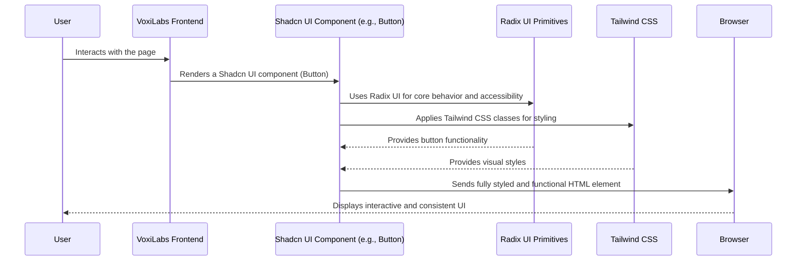

# Chapter 1: Shadcn UI Component Library

Welcome to the first chapter of our VoxiLabs tutorial! In this chapter, we're going to dive into the world of **Shadcn UI**, a powerful tool that helps us build beautiful and consistent user interfaces for our application.

## Why Do We Need a UI Component Library?

Imagine you're building a house. You wouldn't make every single brick from scratch, right? You'd buy pre-made bricks, windows, and doors that fit together nicely and look good.

Building a software application is very similar. Our VoxiLabs application needs many visual parts, like:

*   **Buttons:** For things like "Sign Up" or "Generate Video."
*   **Input fields:** Where you type your email or password.
*   **Cards:** To display information, like details about a generated video.
*   **Navigation menus:** To move between different parts of the application.

If we had to design and build each of these elements from scratch every single time, it would be:

1.  **Slow:** It takes a lot of time to write all the code for styling and making them work.
2.  **Inconsistent:** Different buttons might look slightly different, making the app feel messy.
3.  **Hard to maintain:** If you want to change the color of all buttons, you'd have to edit many places.

This is where a **UI Component Library** comes in! It's like having a standardized set of high-quality LEGO bricks. These are ready-made "building blocks" that developers can use. They are:

*   **Pre-built:** You don't have to start from zero.
*   **Accessible:** They are designed to work well for all users, including those who use assistive technologies.
*   **Customizable:** You can change their look and feel to match our VoxiLabs brand.

By using a UI component library, we ensure a consistent look and feel across the entire VoxiLabs application and significantly speed up our development.

## What is Shadcn UI?

Shadcn UI is a popular and modern UI component library. But it's a bit special! Unlike some other libraries where you install a single package and use components directly, Shadcn UI takes a different approach:

*   **It's not a traditional NPM package:** You don't `npm install shadcn-ui`. Instead, you use a command-line tool to "add" components. When you "add" a component (like a button), its code is copied directly into your project.
*   **Built on Radix UI:** It uses "Radix UI primitives" for the core functionality and accessibility. Radix UI provides the *behavior* (e.g., how a dropdown opens and closes, how a button handles clicks) without any styling.
*   **Styled with Tailwind CSS:** For the *look and feel*, Shadcn UI uses Tailwind CSS. This is a "utility-first" CSS framework that lets us style elements by adding simple class names directly in our HTML/JSX.

This "copy-paste" approach gives us a lot of control. We get working components that are easy to customize because their code is right there in our project.

## How VoxiLabs Uses Shadcn UI: A Button Example

Let's look at how VoxiLabs uses a Shadcn UI component, specifically a button.

First, to use a Shadcn component like a `Button` in our React application, we would import it:

```typescript
// frontend/src/app/page.tsx (Example usage)
import { Button } from "@/components/ui/button";

function MyPage() {
  return (
    <div>
      <Button onClick={() => alert("Hello VoxiLabs!")}>
        Click Me!
      </Button>
    </div>
  );
}
```
When this code runs, you'll see a styled button on the screen that says "Click Me!". When you click it, a pop-up "Hello VoxiLabs!" will appear. This simple button is not just a basic HTML button; it comes with built-in styling and accessibility features thanks to Shadcn UI.

## Under the Hood: How Shadcn UI Components Work

Let's peek behind the curtain to understand how a Shadcn UI component like our `Button` actually works.

### The Flow of a Shadcn UI Component

Here’s a simplified sequence of what happens when you use a Shadcn UI component in VoxiLabs:



1.  **User Interaction:** A user visits the VoxiLabs application in their browser.
2.  **VoxiLabs Frontend Renders:** Our VoxiLabs React application prepares the user interface. When it encounters a Shadcn component like `<Button>`, it uses the component's definition.
3.  **Shadcn UI Component (e.g., Button):** This is the code for the button that was copied into our project. It acts as a wrapper.
4.  **Radix UI Primitives:** Inside the Shadcn button, there's a reference to a Radix UI `Button` primitive. Radix handles the low-level details, ensuring the button is accessible (e.g., it works well with keyboards or screen readers) and behaves correctly (like handling click events).
5.  **Tailwind CSS:** Shadcn components are heavily styled using Tailwind CSS classes. These classes are added directly to the HTML elements to control their appearance (colors, spacing, size, shadows, etc.).
6.  **Browser Display:** Finally, the browser receives the standard HTML elements with all the necessary CSS classes, rendering a beautiful and functional button on the screen.

### Code Deep Dive: Styling and Structure

Let's look at some key files that make this magic happen.

#### 1. Global Styles and Theming (`frontend/src/index.css`)

VoxiLabs uses a custom design based on the ElevenLabs style. This is set up in `frontend/src/index.css`. This file is where we define our brand's colors using CSS variables and set up global styles.

```css
/* frontend/src/index.css */

@tailwind base;
@tailwind components;
@tailwind utilities;

@layer base {
  :root {
    --background: 0 0% 100%; /* White background */
    --foreground: 240 10% 3.9%; /* Dark text */
    --primary: 257 69% 47%; /* A vibrant purple */
    --primary-foreground: 0 0% 100%; /* White text on primary */
    --border: 220 13% 91%; /* Light gray border */
    --radius: 0.75rem; /* Rounded corners */
  }

  .dark {
    --background: 240 10% 5.5%; /* Dark background */
    --foreground: 0 0% 100%; /* White text */
    --primary: 262 75% 74%; /* Lighter purple for dark mode */
    /* ... other dark mode colors */
  }

  body {
    @apply bg-background text-foreground font-manrope;
  }
}

@layer components {
  /* Primary Button - ElevenLabs Style */
  .btn-primary {
    @apply inline-flex items-center justify-center gap-2
           rounded-full px-6 py-3 text-sm font-medium
           bg-primary text-primary-foreground;
           /* ... more styling ... */
  }
  /* ... other custom components like .input-field, .card-elevated */
}
```
This CSS file first includes Tailwind's base, components, and utility styles. Then, in the `:root` section, it defines custom CSS variables for our color palette (like `--primary` for our main purple color). These variables are used by Shadcn components to pick up VoxiLabs' specific brand colors. It also defines custom reusable classes like `btn-primary` using Tailwind's `@apply` directive.

#### 2. Tailwind Configuration (`frontend/tailwind.config.ts`)

This file tells Tailwind CSS how to generate styles based on our custom themes. It links our CSS variables to Tailwind's utility classes.

```typescript
// frontend/tailwind.config.ts
import type { Config } from "tailwindcss";

export default {
	darkMode: ["class"],
	content: [
		"./pages/**/*.{ts,tsx}",
		"./components/**/*.{ts,tsx}",
		"./app/**/*.{ts,tsx}",
		"./src/**/*.{ts,tsx}",
	],
	theme: {
		extend: {
			colors: {
				border: 'hsl(var(--border))', // Maps --border CSS var to Tailwind's 'border' color
				primary: {
					DEFAULT: 'hsl(var(--primary))', // Maps --primary CSS var
					foreground: 'hsl(var(--primary-foreground)'
				},
				// ... other color mappings
			},
			fontFamily: {
				'sora': ['Sora', 'system-ui', 'sans-serif'],
				'manrope': ['Manrope', 'system-ui', 'sans-serif'],
				'sans': ['Manrope', 'system-ui', 'sans-serif']
			},
			// ... custom spacing, borderRadius, boxShadow, keyframes, animation
		}
	},
	plugins: [require("tailwindcss-animate")],
} satisfies Config;
```
This configuration file is where we tell Tailwind CSS about our custom colors (which pull from the CSS variables in `index.css`), custom fonts (like 'Sora' and 'Manrope'), and even custom animations. This ensures that when a Shadcn component uses `bg-primary` or `text-primary-foreground`, it refers to our VoxiLabs brand colors defined in `index.css`.

#### 3. Utility Function (`frontend/src/lib/utils.ts`)

This small but important file contains a utility function `cn` which helps combine multiple Tailwind CSS classes easily.

```typescript
// frontend/src/lib/utils.ts
import { clsx, type ClassValue } from "clsx"
import { twMerge } from "tailwind-merge"

export function cn(...inputs: ClassValue[]) {
  return twMerge(clsx(inputs))
}
```
The `cn` function uses `clsx` to conditionally join class names (e.g., if a prop is true, add this class) and `twMerge` to intelligently merge them, preventing conflicting styles (e.g., `p-4` and `p-2` will result in `p-2`). This ensures our components' styling is clean and correct.

#### 4. The Button Component (`frontend/src/components/ui/button.tsx`)

Finally, let's look at the actual Shadcn UI `Button` component file.

```typescript
// frontend/src/components/ui/button.tsx
import * as React from "react"
import { Slot } from "@radix-ui/react-slot"
import { cva, type VariantProps } from "class-variance-authority"

import { cn } from "@/lib/utils" // Our utility function

const buttonVariants = cva(
  "inline-flex items-center justify-center gap-2 whitespace-nowrap rounded-md text-sm font-medium ring-offset-background transition-colors focus-visible:outline-none focus-visible:ring-2 disabled:pointer-events-none disabled:opacity-50",
  {
    variants: {
      variant: {
        default: "bg-black text-white hover:bg-black/90",
        destructive: "bg-black text-white hover:bg-black/90",
        outline: "border border-input bg-white text-black hover:bg-accent",
        secondary: "bg-black text-white hover:bg-black/80",
        ghost: "text-black hover:bg-accent",
        link: "text-black underline-offset-4 hover:underline",
      },
      size: {
        default: "h-10 px-4 py-2",
        sm: "h-9 rounded-md px-3",
        lg: "h-11 rounded-md px-8",
        icon: "h-10 w-10",
      },
    },
    defaultVariants: {
      variant: "default",
      size: "default",
    },
  }
)

export interface ButtonProps
  extends React.ButtonHTMLAttributes<HTMLButtonElement>,
    VariantProps<typeof buttonVariants> {
  asChild?: boolean
}

const Button = React.forwardRef<HTMLButtonElement, ButtonProps>(
  ({ className, variant, size, asChild = false, ...props }, ref) => {
    const Comp = asChild ? Slot : "button"
    return (
      <Comp
        className={cn(buttonVariants({ variant, size, className }))}
        ref={ref}
        {...props}
      />
    )
  }
)
Button.displayName = "Button"

export { Button, buttonVariants }
```
This file defines our `Button` component. Key parts:
*   **`cva` (Class Variance Authority):** This powerful tool allows us to define different "variants" (like `default`, `outline`, `destructive`) and "sizes" (`sm`, `default`, `lg`, `icon`) for our button. It then generates the correct Tailwind classes based on the chosen variant and size.
*   **`cn` function:** We use our `cn` utility function to combine the generated `buttonVariants` classes with any additional `className` the developer provides when using the `Button` component.
*   **`Slot` from Radix UI:** This allows the `Button` component to render as a different HTML element if needed, while still maintaining its core behavior and styling. This is an advanced feature that ensures flexibility and accessibility.

Notice how the colors in `buttonVariants` are `bg-black`, `text-white`, `border-input`, etc. These simple class names resolve to our VoxiLabs brand colors because of the setup in `tailwind.config.ts` and `index.css`. This is why all Shadcn components automatically adopt our specific VoxiLabs look!

## Conclusion

In this chapter, we learned that Shadcn UI is like our VoxiLabs "LEGO factory" for building user interfaces. It provides pre-built, accessible, and customizable components that speed up development and ensure a consistent look. We saw how it combines Radix UI for behavior and Tailwind CSS for styling, all while being tightly integrated with our project's custom theming.

Having a solid foundation in our UI components is crucial before we build complex features. Next up, we'll explore how users will sign up and log in to VoxiLabs using an [Authentication System](02_authentication_system_.md)!

---

<sub><sup>Generated by [AI Codebase Knowledge Builder](https://github.com/The-Pocket/Tutorial-Codebase-Knowledge).</sup></sub> <sub><sup>**References**: [[1]](https://github.com/meetvaghani12/VoxiLabs/blob/06efd839ae0d43c6b68889f79e68789ae4d87d3b/frontend/components.json), [[2]](https://github.com/meetvaghani12/VoxiLabs/blob/06efd839ae0d43c6b68889f79e68789ae4d87d3b/frontend/src/components/ui/accordion.tsx), [[3]](https://github.com/meetvaghani12/VoxiLabs/blob/06efd839ae0d43c6b68889f79e68789ae4d87d3b/frontend/src/components/ui/alert-dialog.tsx), [[4]](https://github.com/meetvaghani12/VoxiLabs/blob/06efd839ae0d43c6b68889f79e68789ae4d87d3b/frontend/src/components/ui/alert.tsx), [[5]](https://github.com/meetvaghani12/VoxiLabs/blob/06efd839ae0d43c6b68889f79e68789ae4d87d3b/frontend/src/components/ui/aspect-ratio.tsx), [[6]](https://github.com/meetvaghani12/VoxiLabs/blob/06efd839ae0d43c6b68889f79e68789ae4d87d3b/frontend/src/components/ui/avatar.tsx), [[7]](https://github.com/meetvaghani12/VoxiLabs/blob/06efd839ae0d43c6b68889f79e68789ae4d87d3b/frontend/src/components/ui/badge.tsx), [[8]](https://github.com/meetvaghani12/VoxiLabs/blob/06efd839ae0d43c6b68889f79e68789ae4d87d3b/frontend/src/components/ui/breadcrumb.tsx), [[9]](https://github.com/meetvaghani12/VoxiLabs/blob/06efd839ae0d43c6b68889f79e68789ae4d87d3b/frontend/src/components/ui/button.tsx), [[10]](https://github.com/meetvaghani12/VoxiLabs/blob/06efd839ae0d43c6b68889f79e68789ae4d87d3b/frontend/src/components/ui/calendar.tsx), [[11]](https://github.com/meetvaghani12/VoxiLabs/blob/06efd839ae0d43c6b68889f79e68789ae4d87d3b/frontend/src/components/ui/card.tsx), [[12]](https://github.com/meetvaghani12/VoxiLabs/blob/06efd839ae0d43c6b68889f79e68789ae4d87d3b/frontend/src/components/ui/carousel.tsx), [[13]](https://github.com/meetvaghani12/VoxiLabs/blob/06efd839ae0d43c6b68889f79e68789ae4d87d3b/frontend/src/components/ui/chart.tsx), [[14]](https://github.com/meetvaghani12/VoxiLabs/blob/06efd839ae0d43c6b68889f79e68789ae4d87d3b/frontend/src/components/ui/checkbox.tsx), [[15]](https://github.com/meetvaghani12/VoxiLabs/blob/06efd839ae0d43c6b68889f79e68789ae4d87d3b/frontend/src/components/ui/collapsible.tsx), [[16]](https://github.com/meetvaghani12/VoxiLabs/blob/06efd839ae0d43c6b68889f79e68789ae4d87d3b/frontend/src/components/ui/command.tsx), [[17]](https://github.com/meetvaghani12/VoxiLabs/blob/06efd839ae0d43c6b68889f79e68789ae4d87d3b/frontend/src/components/ui/context-menu.tsx), [[18]](https://github.com/meetvaghani12/VoxiLabs/blob/06efd839ae0d43c6b68889f79e68789ae4d87d3b/frontend/src/components/ui/dialog.tsx), [[19]](https://github.com/meetvaghani12/VoxiLabs/blob/06efd839ae0d43c6b68889f79e68789ae4d87d3b/frontend/src/components/ui/drawer.tsx), [[20]](https://github.com/meetvaghani12/VoxiLabs/blob/06efd839ae0d43c6b68889f79e68789ae4d87d3b/frontend/src/components/ui/dropdown-menu.tsx), [[21]](https://github.com/meetvaghani12/VoxiLabs/blob/06efd839ae0d43c6b68889f79e68789ae4d87d3b/frontend/src/components/ui/form.tsx), [[22]](https://github.com/meetvaghani12/VoxiLabs/blob/06efd839ae0d43c6b68889f79e68789ae4d87d3b/frontend/src/components/ui/hover-card.tsx), [[23]](https://github.com/meetvaghani12/VoxiLabs/blob/06efd839ae0d43c6b68889f79e68789ae4d87d3b/frontend/src/components/ui/input-otp.tsx), [[24]](https://github.com/meetvaghani12/VoxiLabs/blob/06efd839ae0d43c6b68889f79e68789ae4d87d3b/frontend/src/components/ui/input.tsx), [[25]](https://github.com/meetvaghani12/VoxiLabs/blob/06efd839ae0d43c6b68889f79e68789ae4d87d3b/frontend/src/components/ui/label.tsx), [[26]](https://github.com/meetvaghani12/VoxiLabs/blob/06efd839ae0d43c6b68889f79e68789ae4d87d3b/frontend/src/components/ui/menubar.tsx), [[27]](https://github.com/meetvaghani12/VoxiLabs/blob/06efd839ae0d43c6b68889f79e68789ae4d87d3b/frontend/src/components/ui/navigation-menu.tsx), [[28]](https://github.com/meetvaghani12/VoxiLabs/blob/06efd839ae0d43c6b68889f79e68789ae4d87d3b/frontend/src/components/ui/pagination.tsx), [[29]](https://github.com/meetvaghani12/VoxiLabs/blob/06efd839ae0d43c6b68889f79e68789ae4d87d3b/frontend/src/components/ui/popover.tsx), [[30]](https://github.com/meetvaghani12/VoxiLabs/blob/06efd839ae0d43c6b68889f79e68789ae4d87d3b/frontend/src/components/ui/progress.tsx), [[31]](https://github.com/meetvaghani12/VoxiLabs/blob/06efd839ae0d43c6b68889f79e68789ae4d87d3b/frontend/src/components/ui/radio-group.tsx), [[32]](https://github.com/meetvaghani12/VoxiLabs/blob/06efd839ae0d43c6b68889f79e68789ae4d87d3b/frontend/src/components/ui/resizable.tsx), [[33]](https://github.com/meetvaghani12/VoxiLabs/blob/06efd839ae0d43c6b68889f79e68789ae4d87d3b/frontend/src/components/ui/scroll-area.tsx), [[34]](https://github.com/meetvaghani12/VoxiLabs/blob/06efd839ae0d43c6b68889f79e68789ae4d87d3b/frontend/src/components/ui/select.tsx), [[35]](https://github.com/meetvaghani12/VoxiLabs/blob/06efd839ae0d43c6b68889f79e68789ae4d87d3b/frontend/src/components/ui/separator.tsx), [[36]](https://github.com/meetvaghani12/VoxiLabs/blob/06efd839ae0d43c6b68889f79e68789ae4d87d3b/frontend/src/components/ui/sheet.tsx), [[37]](https://github.com/meetvaghani12/VoxiLabs/blob/06efd839ae0d43c6b68889f79e68789ae4d87d3b/frontend/src/components/ui/sidebar.tsx), [[38]](https://github.com/meetvaghani12/VoxiLabs/blob/06efd839ae0d43c6b68889f79e68789ae4d87d3b/frontend/src/components/ui/skeleton.tsx), [[39]](https://github.com/meetvaghani12/VoxiLabs/blob/06efd839ae0d43c6b68889f79e68789ae4d87d3b/frontend/src/components/ui/slider.tsx), [[40]](https://github.com/meetvaghani12/VoxiLabs/blob/06efd839ae0d43c6b68889f79e68789ae4d87d3b/frontend/src/components/ui/sonner.tsx), [[41]](https://github.com/meetvaghani12/VoxiLabs/blob/06efd839ae0d43c6b68889f79e68789ae4d87d3b/frontend/src/components/ui/switch.tsx), [[42]](https://github.com/meetvaghani12/VoxiLabs/blob/06efd839ae0d43c6b68889f79e68789ae4d87d3b/frontend/src/components/ui/table.tsx), [[43]](https://github.com/meetvaghani12/VoxiLabs/blob/06efd839ae0d43c6b68889f79e68789ae4d87d3b/frontend/src/components/ui/tabs.tsx), [[44]](https://github.com/meetvaghani12/VoxiLabs/blob/06efd839ae0d43c6b68889f79e68789ae4d87d3b/frontend/src/components/ui/textarea.tsx), [[45]](https://github.com/meetvaghani12/VoxiLabs/blob/06efd839ae0d43c6b68889f79e68789ae4d87d3b/frontend/src/components/ui/toast.tsx), [[46]](https://github.com/meetvaghani12/VoxiLabs/blob/06efd839ae0d43c6b68889f79e68789ae4d87d3b/frontend/src/components/ui/toaster.tsx), [[47]](https://github.com/meetvaghani12/VoxiLabs/blob/06efd839ae0d43c6b68889f79e68789ae4d87d3b/frontend/src/components/ui/toggle-group.tsx), [[48]](https://github.com/meetvaghani12/VoxiLabs/blob/06efd839ae0d43c6b68889f79e68789ae4d87d3b/frontend/src/components/ui/toggle.tsx), [[49]](https://github.com/meetvaghani12/VoxiLabs/blob/06efd839ae0d43c6b68889f79e68789ae4d87d3b/frontend/src/components/ui/tooltip.tsx), [[50]](https://github.com/meetvaghani12/VoxiLabs/blob/06efd839ae0d43c6b68889f79e68789ae4d87d3b/frontend/src/components/ui/use-toast.ts), [[51]](https://github.com/meetvaghani12/VoxiLabs/blob/06efd839ae0d43c6b68889f79e68789ae4d87d3b/frontend/src/index.css), [[52]](https://github.com/meetvaghani12/VoxiLabs/blob/06efd839ae0d43c6b68889f79e68789ae4d87d3b/frontend/src/lib/utils.ts), [[53]](https://github.com/meetvaghani12/VoxiLabs/blob/06efd839ae0d43c6b68889f79e68789ae4d87d3b/frontend/tailwind.config.ts)</sup></sub>