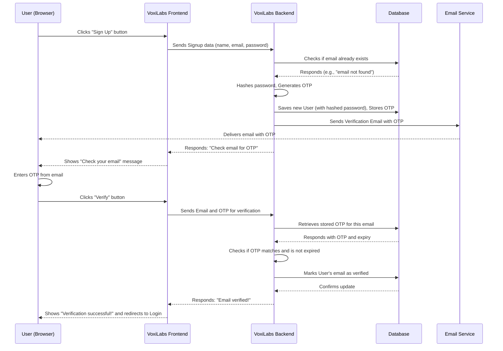

# Chapter 2: Authentication System

Welcome back to the VoxiLabs tutorial! In the [previous chapter](01_shadcn_ui_component_library_.md), we explored Shadcn UI and how it helps us build beautiful, consistent, and ready-to-use building blocks for our application. We learned about buttons, input fields, and how they seamlessly adopt the VoxiLabs style.

Now that we know how to make our application *look good*, the next crucial step is to control *who can use it*. Not everyone should be able to access all features of VoxiLabs, especially those that generate content or store personal information. This is where the **Authentication System** comes into play.

## Why Do We Need an Authentication System?

Imagine VoxiLabs as a highly secure creative studio. You wouldn't want just anyone walking in and using all your advanced video generation tools, right? You need a way to know **who** is entering and to confirm their **identity**.

This is exactly what an **Authentication System** does for our application. It's like the security guard and ID card system for VoxiLabs:

*   **Signing Up:** When you first join, it's like registering for a membership and getting your own unique ID card.
*   **Logging In:** Every time you want to enter the studio, you show your ID card (username and password) to the security guard (the authentication system).
*   **Verifying Identity:** Sometimes, for extra security, the guard might ask for a secret code sent to your phone or email.
*   **Managing Sessions:** Once you're inside, the guard remembers you for a while, so you don't have to show your ID card at every door. This is your "session."
*   **Protected Access:** Only people with a valid ID card can access the special areas of the studio, like the video generation lab.

For VoxiLabs, the authentication system handles everything from creating your account to keeping you securely logged in. It ensures that only authorized users can create videos, manage their settings, and access their content. It also makes it super convenient by allowing you to sign in using your Google account!

## Key Parts of VoxiLabs' Authentication System

Our VoxiLabs authentication system is designed to be robust and user-friendly. Here are its core responsibilities:

1.  **User Registration (Sign Up):** Allows new users to create an account by providing their details like name, email, and a password.
2.  **Email Verification:** After signing up, we send a secret code (OTP - One-Time Password) to the user's email to confirm they own that email address. This is a common security practice.
3.  **User Login (Sign In):** Enables returning users to access their accounts using their registered email and password.
4.  **Google Sign-in:** Offers a quick and easy way to sign up or log in using an existing Google account, avoiding the need to remember another password.
5.  **Session Management:** Once logged in, the system keeps track of the user's "session" so they remain logged in as they navigate through the application without having to re-enter their credentials repeatedly.
6.  **Password Management:** Includes features like "Forgot Password" to help users regain access if they forget their password.

## How a User Interacts with Authentication (Frontend)

Let's walk through a common scenario: a new user signs up and logs in to VoxiLabs. We'll see how the different parts of the frontend code work together using the authentication system.

### 1. Signing Up

When a user visits `/signup`, they see a form to create an account. They fill in their first name, last name, email, and password.

```typescript
// frontend/src/pages/Signup.tsx (simplified)
import { useState } from "react";
import { useNavigate } from "react-router-dom";
import { toast } from "sonner"; // For notifications
import authService from "@/services/auth"; // Our authentication helper

const Signup = () => {
  const [formData, setFormData] = useState({ /* ...form fields */ });
  const [isLoading, setIsLoading] = useState(false);
  const navigate = useNavigate();

  const handleSubmit = async (e: React.FormEvent) => {
    e.preventDefault();
    setIsLoading(true); // Show loading state

    try {
      const response = await authService.signup({
        firstName: formData.firstName,
        lastName: formData.lastName,
        email: formData.email,
        password: formData.password,
      });
      toast.success(response.message); // Show success message
      // After successful signup, navigate to verify email page
      navigate('/verify-email', { state: { email: response.email } });
    } catch (error: any) {
      toast.error(error.response?.data?.message || "Failed to create account");
    } finally {
      setIsLoading(false);
    }
  };

  // ... rest of the component (form rendering, etc.)
  return (
    <form onSubmit={handleSubmit}>
      {/* Input fields for firstName, lastName, email, password */}
      <button type="submit" disabled={isLoading}>
        {isLoading ? "Creating Account..." : "Create Account"}
      </button>
    </form>
  );
};
```
**Explanation:**
*   The `Signup` component uses `useState` to manage the form data.
*   When the form is submitted, `handleSubmit` is called.
*   It then calls `authService.signup` (a function we'll look at soon) to send the user's data to our backend.
*   If successful, it shows a `toast` message and sends the user to the `/verify-email` page, passing their email so the next step knows which email to verify.

### 2. Email Verification

After signing up, users are directed to the `/verify-email` page. Here, they enter the 6-digit code sent to their email.

```typescript
// frontend/src/pages/VerifyEmail.tsx (simplified)
import { useState } from "react";
import { useNavigate, useLocation } from "react-router-dom";
import { toast } from "sonner";
import authService from "@/services/auth";

const VerifyEmail = () => {
  const [otp, setOtp] = useState("");
  const [isLoading, setIsLoading] = useState(false);
  const navigate = useNavigate();
  const location = useLocation();
  const email = location.state?.email; // Get email from signup page

  if (!email) { // Redirect if no email found (e.g., direct access)
    navigate('/signup'); return null;
  }

  const handleSubmit = async (e: React.FormEvent) => {
    e.preventDefault();
    setIsLoading(true);
    try {
      await authService.verifyEmail(email, otp); // Call backend to verify
      toast.success("Email verified successfully!");
      navigate('/login'); // Go to login after verification
    } catch (error: any) {
      toast.error(error.response?.data?.message || "Failed to verify email");
    } finally {
      setIsLoading(false);
    }
  };

  // ... rest of the component
  return (
    <form onSubmit={handleSubmit}>
      <input type="text" value={otp} onChange={(e) => setOtp(e.target.value)} />
      <button type="submit" disabled={isLoading}>
        {isLoading ? "Verifying..." : "Verify Email"}
      </button>
      <button onClick={handleResendOTP}>Resend Code</button>
    </form>
  );
};
```
**Explanation:**
*   This component receives the `email` from the previous page using `useLocation`.
*   It captures the OTP entered by the user.
*   `authService.verifyEmail` is called to check the OTP with the backend.
*   If the OTP is correct, the user's email is marked as verified, and they are sent to the `/login` page.

### 3. Logging In

Once verified (or if they're a returning user), they can log in at `/login`.

```typescript
// frontend/src/pages/Login.tsx (simplified)
import { useState } from "react";
import { useNavigate } from "react-router-dom";
import { toast } from "sonner";
import authService from "@/services/auth";

const Login = () => {
  const [email, setEmail] = useState("");
  const [password, setPassword] = useState("");
  const [isLoading, setIsLoading] = useState(false);
  const navigate = useNavigate();

  const handleSubmit = async (e: React.FormEvent) => {
    e.preventDefault();
    setIsLoading(true);
    try {
      await authService.login({ email, password }); // Call backend to log in
      toast.success("Login successful!");
      navigate("/dashboard"); // Go to dashboard on success
    } catch (error: any) {
      const errorMessage = error.response?.data?.message || "Failed to login";
      toast.error(errorMessage);
      // Special handling for unverified email to redirect them back to verify page
      if (errorMessage.includes('Email not verified') && error.response?.data?.email) {
        navigate('/verify-email', { state: { email: error.response.data.email } });
      }
    } finally {
      setIsLoading(false);
    }
  };

  // ... rest of the component
  return (
    <form onSubmit={handleSubmit}>
      <input type="email" placeholder="Email" value={email} onChange={(e) => setEmail(e.target.value)} />
      <input type="password" placeholder="Password" value={password} onChange={(e) => setPassword(e.target.value)} />
      <button type="submit" disabled={isLoading}>
        {isLoading ? "Signing in..." : "Sign In"}
      </button>
    </form>
  );
};
```
**Explanation:**
*   Similar to signup, `Login` component collects email and password.
*   It calls `authService.login`.
*   If login is successful, the user is redirected to the `/dashboard`.
*   An important detail: if the login fails because the email isn't verified, it redirects the user back to the verification page.

### 4. Google Sign-in

VoxiLabs also supports signing in with Google for convenience.

```typescript
// frontend/src/pages/Login.tsx or Signup.tsx (simplified button)
import { Mail } from "lucide-react"; // Icon for Google button
import authService from "@/services/auth";

const handleGoogleSignup = async () => {
  try {
    const authUrl = await authService.initiateGoogleAuth(); // Get Google's login URL
    window.location.href = authUrl; // Redirect browser to Google
  } catch (error: any) {
    toast.error("Failed to initiate Google signup");
  }
};

// ... inside render method
<button onClick={handleGoogleSignup}>
  <Mail className="mr-2 w-4 h-4" />
  Continue with Google
</button>
```
```typescript
// frontend/src/pages/GoogleCallback.tsx (simplified)
import { useEffect } from 'react';
import { useNavigate, useLocation } from 'react-router-dom';
import { toast } from 'sonner';
import authService from '@/services/auth';

const GoogleCallback = () => {
  const navigate = useNavigate();
  const location = useLocation();

  useEffect(() => {
    const handleCallback = async () => {
      const searchParams = new URLSearchParams(location.search);
      const code = searchParams.get('code'); // Get the authorization code from Google

      if (!code) { /* Handle error */ return; }

      try {
        await authService.googleLogin(code); // Send code to our backend
        toast.success('Successfully logged in with Google!');
        navigate('/dashboard'); // Success! Go to dashboard
      } catch (error: any) {
        toast.error(error.response?.data?.message || 'Failed to authenticate with Google');
        navigate('/login'); // Redirect to login on error
      }
    };
    handleCallback();
  }, [navigate, location]);

  return (
    <div>Authenticating with Google...</div> // Simple loading message
  );
};
```
**Explanation:**
*   When a user clicks "Continue with Google," our frontend asks the backend for a special Google login URL (`authService.initiateGoogleAuth`).
*   The browser then redirects the user to Google's login page.
*   After the user logs into Google and grants permission, Google redirects them back to our `GoogleCallback.tsx` page, providing a special `code`.
*   Our `GoogleCallback.tsx` then sends this `code` to our backend (`authService.googleLogin`). Our backend talks to Google to verify the code and create a VoxiLabs user or log them in.
*   Finally, if successful, the user is redirected to the dashboard.

### 5. Frontend Authentication Service (`authService.ts` & `auth.ts`)

These two files are crucial for the frontend's interaction with the authentication system.

*   `frontend/src/services/authService.ts`: This file acts as a simple storage manager for the authentication token (our digital ID card). It uses `localStorage` to keep the token available across browser sessions.

    ```typescript
    // frontend/src/services/authService.ts (simplified)
    const TOKEN_KEY = 'auth_token'; // Key to store token in browser

    export const getAuthToken = (): string | null => {
      return localStorage.getItem(TOKEN_KEY);
    };

    export const setAuthToken = (token: string): void => {
      localStorage.setItem(TOKEN_KEY, token);
    };

    export const removeAuthToken = (): void => {
      localStorage.removeItem(TOKEN_KEY);
    };

    export const isAuthenticated = (): boolean => {
      return !!getAuthToken(); // Checks if a token exists
    };
    ```
    **Explanation:** These are simple utility functions. `setAuthToken` saves the special "ID card" in your browser's memory, `getAuthToken` retrieves it, and `removeAuthToken` discards it when you log out. `isAuthenticated` quickly tells us if you're currently "holding" an ID card.

*   `frontend/src/services/auth.ts`: This is the main service that talks to our backend API for all authentication-related actions.

    ```typescript
    // frontend/src/services/auth.ts (simplified)
    import axios from 'axios'; // Tool to make web requests

    const API_URL = `${import.meta.env.VITE_API_URL || 'http://localhost:5000/api'}/auth`;

    const authService = {
      async signup(data: any) {
        const response = await axios.post(`${API_URL}/register`, data);
        return response.data;
      },

      async verifyEmail(email: string, otp: string) {
        const response = await axios.post(`${API_URL}/verify-email`, { email, otp });
        return response.data;
      },

      async login(data: any) {
        const response = await axios.post(`${API_URL}/login`, data);
        if (response.data.token) {
          localStorage.setItem('token', response.data.token); // Store token on login
          localStorage.setItem('user', JSON.stringify(response.data.user)); // Store user info
        }
        return response.data;
      },

      async googleLogin(code: string) {
        const response = await axios.post(`${API_URL}/google/callback`, { code });
        if (response.data.token) {
          localStorage.setItem('token', response.data.token); // Store token on Google login
          localStorage.setItem('user', JSON.stringify(response.data.user));
        }
        return response.data;
      },

      async initiateGoogleAuth() {
        const response = await axios.get(`${API_URL}/google`);
        return response.data.authUrl; // Returns the URL to Google's login page
      },

      logout(): void {
        localStorage.removeItem('token'); // Remove token on logout
        localStorage.removeItem('user');
      },

      isAuthenticated(): boolean {
        return !!localStorage.getItem('token'); // Check if token exists
      }
    };

    export default authService;
    ```
    **Explanation:** This service acts as the "messenger" between our VoxiLabs frontend and the backend authentication system. It uses `axios` to send data (like your email and password) and receive responses (like success messages or your unique token). Notice how `login` and `googleLogin` directly use `localStorage.setItem` to save the `token` received from the backend, which our `frontend/src/services/authService.ts` then manages.

### 6. Protecting Routes and Displaying UI (Frontend)

Finally, for user experience, we have `ProtectedRoute` and `Navigation`.

*   `frontend/src/components/ProtectedRoute.tsx`: This component ensures that certain pages (like the dashboard or video editor) can only be accessed by logged-in users.

    ```typescript
    // frontend/src/components/ProtectedRoute.tsx (simplified)
    import { Navigate, useLocation } from 'react-router-dom';
    import authService from '@/services/auth'; // Our authentication check

    interface ProtectedRouteProps {
      children: React.ReactNode;
    }

    const ProtectedRoute: React.FC<ProtectedRouteProps> = ({ children }) => {
      const location = useLocation();
      const isAuthenticated = authService.isAuthenticated(); // Check if user has a token

      if (!isAuthenticated) {
        // If not authenticated, send them to the login page
        // We also store their current location, so they can be redirected back after login.
        return <Navigate to="/login" state={{ from: location }} replace />;
      }

      return <>{children}</>; // If authenticated, show the content of the protected page
    };

    export default ProtectedRoute;
    ```
    **Explanation:** `ProtectedRoute` is like a bouncer at a club. If you don't have a valid ID (`isAuthenticated` is false), it won't let you in and instead sends you to the login page. If you do, it lets you see the page (`children`).

*   `frontend/src/components/Navigation.tsx`: This component changes what you see in the navigation bar based on whether you're logged in.

    ```typescript
    // frontend/src/components/Navigation.tsx (simplified)
    import { Link, useNavigate } from "react-router-dom";
    import { Button } from "@/components/ui/button"; // From Chapter 1!
    import { useEffect, useState } from "react";
    import authService from "@/services/auth";

    export const Navigation = () => {
      const [isAuthenticated, setIsAuthenticated] = useState(false);
      const navigate = useNavigate();

      useEffect(() => {
        setIsAuthenticated(authService.isAuthenticated()); // Check authentication status
      }, []); // Run once on load

      const handleLogout = () => {
        authService.logout(); // Remove the token
        setIsAuthenticated(false); // Update state
        navigate('/'); // Go to home page
      };

      return (
        <nav>
          {/* ... VoxiLabs logo link */}
          <div>
            {isAuthenticated ? (
              <>
                <Link to="/editor"><Button>Generate</Button></Link>
                <Button variant="outline" onClick={handleLogout}>Logout</Button>
              </>
            ) : (
              <>
                <Link to="/login"><Button variant="ghost">Login</Button></Link>
                <Link to="/signup"><Button>Get Started Free</Button></Link>
              </>
            )}
          </div>
        </nav>
      );
    };
    ```
    **Explanation:** This component dynamically shows "Login" and "Sign Up" buttons if you're not logged in, or "Generate" and "Logout" buttons if you are. It uses `authService.isAuthenticated()` to make this decision.

## Under the Hood: How the Authentication System Works (Backend)

Now, let's peek behind the scenes to see how our VoxiLabs backend handles all these authentication requests. When you interact with the frontend, your browser sends requests to the backend, which then processes them.

### High-Level Flow: User Signup

Let's illustrate the signup and email verification process with a simplified flow:



### The Backend Components

The VoxiLabs backend, built with Node.js and Express.js, organizes authentication logic into several key files:

1.  **The "Brains" (Controller): `backend/src/auth/controller/auth-controller.ts`**
    This file contains the main functions that handle incoming requests from the frontend. It's like the manager of the security system.

    ```typescript
    // backend/src/auth/controller/auth-controller.ts (simplified register)
    import { Request, Response } from 'express';
    import bcrypt from 'bcrypt'; // For password hashing
    import { generateOTP, storeOTP } from '../utils/login-utils'; // OTP helpers
    import { sendVerificationEmail } from '../utils/mail'; // Email sender
    import { createUser, findUserByEmail, updateUser } from '../db/user'; // Database operations
    import crypto from 'crypto'; // For generating secrets

    export const register = async (req: Request, res: Response): Promise<void> => {
      try {
        const { firstName, lastName, email, password } = req.body;
        const existingUser = await findUserByEmail(email);
        if (existingUser) {
          res.status(400).json({ message: 'User already exists' }); return;
        }

        const hashedPassword = await bcrypt.hash(password, 10); // Hash the password
        const twoFactorSecret = crypto.randomBytes(32).toString('hex'); // For future 2FA

        await createUser({ // Save new user to database
          firstName, lastName, email, password: hashedPassword, twoFactorSecret,
        });

        const otp = await generateOTP(email); // Generate unique OTP
        await storeOTP(email, otp); // Store OTP for verification
        await sendVerificationEmail(email, otp, firstName); // Send email

        res.status(201).json({ message: 'User registered. Check email for verification.', email });
      } catch (error) {
        console.error('Registration error:', error);
        res.status(500).json({ message: 'Server error during registration' });
      }
    };

    export const verifyEmail = async (req: Request, res: Response): Promise<void> => {
      try {
        const { email, otp } = req.body;
        const isValid = await verifyOTP(email, otp); // Check if OTP is valid
        if (!isValid) { res.status(400).json({ message: 'Invalid code' }); return; }

        await updateUser(email, { emailVerified: new Date() }); // Mark email as verified
        res.status(200).json({ message: 'Email verified successfully' });
      } catch (error) { /* ... error handling */ }
    };
    // ... other functions like login, resendOTP, forgotPassword, etc.
    ```
    **Explanation:** The `register` function takes user data, checks if the user already exists, **hashes the password** for security (never store plain passwords!), creates a new user in the database, generates an OTP, stores it, and sends the verification email. The `verifyEmail` function checks the OTP and updates the user's status.

2.  **The "Secret Keeper" (JWT): `backend/src/auth/utils/jwt.ts`**
    After a successful login, the backend gives the user a special "ID card" called a **JSON Web Token (JWT)**. This token is like a signed pass that proves who you are without sending your password every time.

    ```typescript
    // backend/src/auth/utils/jwt.ts (simplified)
    import jwt from 'jsonwebtoken';

    const JWT_SECRET = process.env.JWT_SECRET || 'your-super-secret-key';
    const JWT_EXPIRES_IN = process.env.JWT_EXPIRES_IN || '30d'; // Token valid for 30 days

    export const generateToken = (payload: Record<string, any>): string => {
      // Create a new token with user's ID and email, valid for 30 days
      return jwt.sign(payload, JWT_SECRET, { expiresIn: JWT_EXPIRES_IN });
    };

    export const verifyToken = (token: string): any | null => {
      try {
        return jwt.verify(token, JWT_SECRET); // Check if the token is valid and not tampered with
      } catch (error) {
        return null; // Token is invalid or expired
      }
    };
    ```
    **Explanation:** `generateToken` creates a unique string for the user after login. This string contains basic info (like user ID and email) and is "signed" with a secret key so no one can fake it. `verifyToken` checks if a given token is real and hasn't expired. This token is stored on the frontend (in `localStorage`) and sent with every request to protected routes.

3.  **The "Code Sender" (OTP & Email): `backend/src/auth/utils/login-utils.ts` & `backend/src/auth/utils/mail.ts`**
    These files work together to handle OTPs (One-Time Passwords) and sending emails.

    ```typescript
    // backend/src/auth/utils/login-utils.ts (simplified)
    import { Redis } from 'ioredis'; // For temporary storage of OTPs

    const redis = new Redis({ /* ... Redis connection details */ });
    const OTP_EXPIRY_MINUTES = 10;

    export const generateOTP = async (email: string): Promise<string> => {
      // Generates a random 6-digit number
      return Math.floor(100000 + Math.random() * 900000).toString();
    };

    export const storeOTP = async (email: string, otp: string): Promise<void> => {
      const key = `otp:${email}`;
      await redis.set(key, JSON.stringify({ otp, expiryTime: new Date(Date.now() + OTP_EXPIRY_MINUTES * 60 * 1000).toISOString() }));
      await redis.expire(key, OTP_EXPIRY_MINUTES * 60); // OTP expires in Redis after 10 minutes
    };

    export const verifyOTP = async (email: string, providedOTP: string): Promise<boolean> => {
      const key = `otp:${email}`;
      const storedData = await redis.get(key);
      if (!storedData) return false;
      const { otp, expiryTime } = JSON.parse(storedData);
      if (new Date(expiryTime) < new Date()) { // Check if expired
        await redis.del(key); return false;
      }
      if (otp !== providedOTP) return false; // Check if matches
      await redis.del(key); // Delete OTP after successful use
      return true;
    };
    ```
    ```typescript
    // backend/src/auth/utils/mail.ts (simplified)
    import nodemailer from 'nodemailer';

    const transporter = nodemailer.createTransport({ /* ... SMTP server details */ });

    export const sendVerificationEmail = async (email: string, otp: string, firstName: string): Promise<void> => {
      const mailOptions = {
        from: `"VoxiLabs" <${process.env.SMTP_USER}>`,
        to: email,
        subject: 'Verify Your Email Address',
        html: `
          <p>Hello ${firstName}, your verification code is: <strong>${otp}</strong></p>
          <p>This code will expire in 10 minutes.</p>
        `,
      };
      await transporter.sendMail(mailOptions);
    };
    ```
    **Explanation:** `generateOTP` creates a random number. `storeOTP` saves this number temporarily in a fast database called **Redis** and sets a timer for it to expire (like a self-destructing message). `verifyOTP` checks if the code entered by the user matches the one stored and if it's still valid. `sendVerificationEmail` then uses a service like Nodemailer to actually send that OTP to the user's email address.

4.  **The "Record Keeper" (Database Interaction): `backend/src/auth/db/user.ts`**
    This file handles all direct communication with our main database (PostgreSQL in VoxiLabs, managed by [Prisma ORM & Database Layer](07_prisma_orm___database_layer_.md)). It's where user accounts, sessions, and verification tokens are stored.

    ```typescript
    // backend/src/auth/db/user.ts (simplified)
    import { PrismaClient, User } from '@prisma/client';

    const prisma = new PrismaClient(); // Our tool for talking to the database

    export const findUserByEmail = async (email: string): Promise<User | null> => {
      return prisma.user.findUnique({ where: { email } });
    };

    export const createUser = async (userData: any): Promise<User> => {
      return prisma.user.create({ data: userData });
    };

    export const updateUser = async (email: string, data: any): Promise<User> => {
      return prisma.user.update({ where: { email }, data });
    };

    export const createSession = async (data: any): Promise<void> => {
      await prisma.session.create({ data });
    };

    export const deleteSession = async (sessionToken: string): Promise<void> => {
      await prisma.session.delete({ where: { sessionToken } });
    };
    // ... functions for finding/deleting verification tokens
    ```
    **Explanation:** These functions are the direct interface to our database. When `auth-controller.ts` needs to save a new user, find an existing one, or update an email's verification status, it calls these functions. `createSession` and `deleteSession` are used to store and remove the JWT "ID cards" (sessions) in the database, ensuring they are valid and tracked.

5.  **The "Google Helper" (OAuth): `backend/src/auth/controller/google-auth-controller.ts`**
    This controller specifically manages the Google login flow.

    ```typescript
    // backend/src/auth/controller/google-auth-controller.ts (simplified)
    import { Request, Response } from 'express';
    import { googleClient } from '../utils/oauth-config'; // Google API client
    import { generateToken } from '../utils/jwt';
    import { findUserByEmail, createUser } from '../db/user';
    import { PrismaClient } from '@prisma/client';
    import crypto from 'crypto';

    const prisma = new PrismaClient();

    export const initiateGoogleAuth = async (_req: Request, res: Response): Promise<void> => {
      const authUrl = googleClient.generateAuthUrl({ /* ... scopes ... */ });
      res.json({ authUrl }); // Send Google's login URL to frontend
    };

    export const handleGoogleCallback = async (req: Request, res: Response): Promise<void> => {
      try {
        const code = req.method === 'GET' ? req.query.code as string : req.body.code;
        const { tokens } = await googleClient.getToken(code); // Exchange Google's code for access tokens
        googleClient.setCredentials(tokens);

        const { data } = await googleClient.request<any>({ url: 'https://www.googleapis.com/oauth2/v2/userinfo' });
        const { email, given_name, family_name, picture } = data;

        let user = await findUserByEmail(email);
        if (!user) { // If it's a new user via Google, create an account
          user = await createUser({
            firstName: given_name, lastName: family_name, email,
            password: crypto.randomBytes(32).toString('hex'), // Random password for Google signups
            image: picture,
          });
        }

        const token = generateToken({ userId: user.id, email: user.email }); // Create our JWT token
        await prisma.session.create({ data: { sessionToken: token, userId: user.id, expires: new Date(Date.now() + 30 * 24 * 60 * 60 * 1000) } });

        // Redirect or respond based on request type
        if (req.method === 'GET') {
          res.redirect(`${process.env.CLIENT_URL}/auth-callback?token=${token}`);
        } else {
          res.status(200).json({ token, user: { id: user.id, email: user.email, firstName: user.firstName } });
        }
      } catch (error) { /* ... error handling */ }
    };
    ```
    **Explanation:** `initiateGoogleAuth` provides the special URL that sends the user to Google to log in. `handleGoogleCallback` is the endpoint that Google redirects to. It receives a temporary `code` from Google, exchanges it for user information (like email and name), checks if the user exists in our database, creates a new VoxiLabs account if they don't, generates our own JWT, creates a session, and then either redirects the user or sends back the authentication token to the frontend.

## Conclusion

In this chapter, we've explored the VoxiLabs Authentication System, understanding its vital role in securing our application and managing user identities. We've seen how users can sign up, log in, verify their emails, and even use convenient Google sign-in. We also briefly looked at how the frontend interacts with this system and peered behind the curtain to understand the backend components that power it, from hashing passwords and generating JWTs to sending verification emails and managing user sessions.

Having a robust authentication system is the foundation for any secure application. Next up, we'll dive deeper into the specific utilities that enable features like email verification: [OTP & Email Utilities](03_otp___email_utilities_.md)!

---