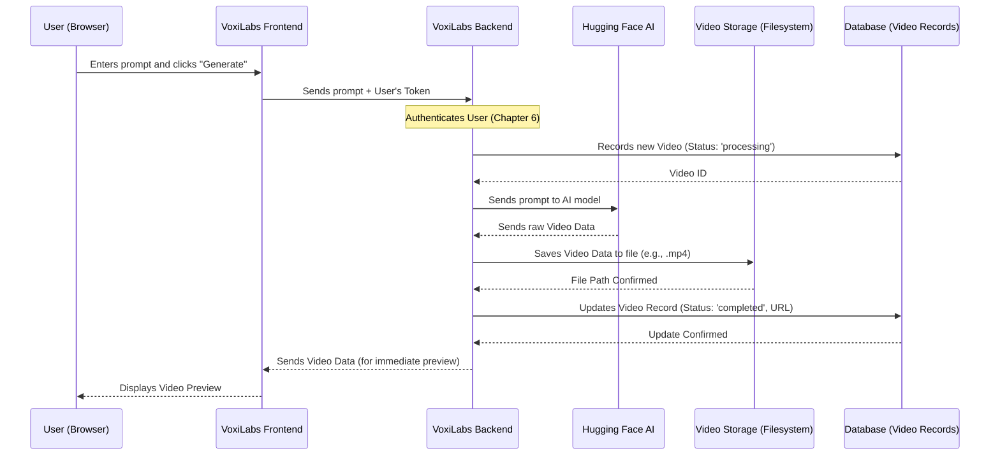

# Chapter 4: Video Generation Service

Welcome back to the VoxiLabs tutorial! In the [previous chapter](03_otp___email_utilities_.md), we got to know the VoxiLabs "post office" and "secure safe"—our OTP and Email Utilities—which play a crucial role in user authentication and communication. We saw how they handle everything from sending verification codes to managing password resets securely.

Now that we understand how users are securely managed and communicated with, it's time to dive into what makes VoxiLabs truly special: its ability to create content! This chapter will introduce you to the **Video Generation Service**, the core engine that turns your ideas into stunning AI-generated videos.

## Why Do We Need a Video Generation Service?

Imagine you have a fantastic idea for a video, but you don't have cameras, actors, or complex editing software. This is where VoxiLabs steps in! Our Video Generation Service is like having your own sophisticated **movie studio** at your fingertips. Instead of writing a script for human actors, you simply provide a **text description** (called a "prompt"), and our service automatically produces a professional video for you.

The central problem this service solves is transforming simple text into dynamic visual content. It makes video creation accessible to everyone, without needing any technical video editing skills.

## Key Concepts of the Video Generation Service

Let's break down the main ideas behind how VoxiLabs creates videos from text:

1.  **Text-to-Video Transformation:** This is the magic! You give the service a written prompt (e.g., "A futuristic city at sunset with flying cars"), and it uses advanced Artificial Intelligence (AI) to bring that description to life as a video.

2.  **Hugging Face Inference API:** To perform this AI magic, VoxiLabs doesn't build the AI models from scratch. Instead, we connect to powerful, pre-trained AI models provided by **Hugging Face**. Think of Hugging Face as a massive library of brilliant AI brains. The "Inference API" is how our VoxiLabs backend sends your text prompt to these brains and gets the generated video back.

3.  **Video Storage:** Once a video is generated by the AI, it needs a place to live. Our service takes the raw video data and saves it as a file on our server. This makes sure your video is always available for you to view later.

4.  **Playback & Availability:** After saving, the service provides a special web address (URL) for your video. This URL allows you to immediately play your generated video right in your browser, download it, or share it with others.

## How VoxiLabs Uses the Video Generation Service (Frontend)

Let's walk through how a user interacts with the Video Generation Service in the VoxiLabs application, specifically using the "Editor" page.

### The "Editor" Page (`frontend/src/pages/Editor.tsx`)

This is where users write their script and trigger the video generation.

```typescript
// frontend/src/pages/Editor.tsx (simplified to show core logic)
import { useState, useRef, useEffect } from "react";
import { Button } from "@/components/ui/button";
import { Textarea } from "@/components/ui/textarea";
import { Loader2, Play } from "lucide-react";
import { toast } from "sonner"; // For notifications
import { Navigation } from "@/components/Navigation"; // From Chapter 2

const BACKEND_URL = import.meta.env.VITE_API_URL || 'http://localhost:5000/api';

const Editor = () => {
  const [script, setScript] = useState("");
  const [isGenerating, setIsGenerating] = useState(false);
  const [videoUrl, setVideoUrl] = useState<string | null>(null);
  const videoRef = useRef<HTMLVideoElement>(null);

  const handleGenerate = async () => {
    if (!script.trim()) {
      toast.error("Please enter a script first"); return;
    }

    setIsGenerating(true); // Show loading spinner
    try {
      const token = localStorage.getItem('token'); // Get user's ID card
      if (!token) { throw new Error('You must be logged in to generate videos'); }

      const response = await fetch(`${BACKEND_URL}/generate-video`, {
        method: 'POST',
        headers: {
          'Content-Type': 'application/json',
          'Authorization': `Bearer ${token}`, // Send user's ID card
        },
        body: JSON.stringify({ prompt: script }), // Send the script to backend
      });

      if (!response.ok) { // Check if the backend responded with an error
        throw new Error(`Failed to generate video: ${response.statusText}`);
      }

      const blob = await response.blob(); // Get the video data as a 'blob'
      const url = URL.createObjectURL(blob); // Create a temporary URL for the video
      setVideoUrl(url); // Update state to display the video

      toast.success("Video generated successfully!");
    } catch (error) {
      console.error('Generation error:', error);
      toast.error(error instanceof Error ? error.message : "Failed to generate video.");
    } finally {
      setIsGenerating(false); // Hide loading spinner
    }
  };

  // Clean up the temporary video URL when the component is removed
  useEffect(() => {
    return () => {
      if (videoUrl) { URL.revokeObjectURL(videoUrl); }
    };
  }, [videoUrl]);

  return (
    <div>
      <Navigation />
      <div>
        <Textarea
          placeholder="Enter your script here..."
          value={script}
          onChange={(e) => setScript(e.target.value)}
          disabled={isGenerating}
        />
        <Button onClick={handleGenerate} disabled={isGenerating}>
          {isGenerating ? (<><Loader2 className="animate-spin" /> Generating...</>) : 'Generate Video'}
        </Button>
        {videoUrl ? (
          <video src={videoUrl} controls className="w-full h-auto" ref={videoRef} />
        ) : (
          <div><Play /> Video preview will appear here</div>
        )}
      </div>
    </div>
  );
};

export default Editor;
```
**Explanation:**
1.  **Script Input:** The `Textarea` is where you type your video description (the `script`).
2.  **`handleGenerate` Function:** When you click "Generate Video":
    *   It first checks if you've entered any text.
    *   It sets `isGenerating` to `true` to show a loading spinner, letting you know something is happening.
    *   **Authentication Check:** It retrieves your authentication `token` (your digital ID card from [Chapter 2: Authentication System](02_authentication_system_.md)) from your browser's local storage. If no token is found, it won't proceed, as video generation is a protected feature.
    *   **Backend Request:** It then sends a `POST` request to our backend API at `/generate-video`. This request includes your `script` and your `token` in the headers (to prove you're an authenticated user).
    *   **Response Handling:**
        *   If the backend responds successfully (`response.ok`), it receives the raw video data as a `blob`.
        *   `URL.createObjectURL(blob)` is a cool browser feature that creates a temporary URL for this `blob`, allowing the `<video>` element to play it immediately without saving it to your computer.
        *   `setVideoUrl` updates the component's state, making the generated video appear in the "Preview" section.
        *   A `toast.success` message pops up to confirm the video is ready.
    *   **Error Handling:** If anything goes wrong (e.g., network error, backend error, or no token), an error message is shown using `toast.error`.
    *   Finally, `isGenerating` is set back to `false`, removing the loading spinner.
3.  **Cleanup (`useEffect`):** The `useEffect` hook ensures that the temporary video URL created by `URL.createObjectURL` is properly cleaned up when the `Editor` page is no longer active. This prevents memory leaks in your browser.

This frontend part is straightforward: collect input, send it to the backend, and display the result. The real "magic" happens behind the scenes in our VoxiLabs backend!

## Under the Hood: How the Video Generation Service Works

Now, let's peek behind the curtain to understand how our VoxiLabs backend handles turning your text into video.

### High-Level Flow: From Prompt to Video

Here’s a simplified sequence of what happens when you click "Generate Video":



### The Backend Components in Detail

The core logic for the Video Generation Service lives in these backend files:

#### 1. The "Traffic Controller": `backend/src/routes/video-routes.ts`

This file defines the API endpoints that the frontend talks to. It also ensures that only authenticated users can access the video generation features.

```typescript
// backend/src/routes/video-routes.ts
import { Router } from 'express';
import { generateVideo, getUserVideos, getVideo, deleteVideo } from '../controllers/video-controller';
import { authenticateToken } from '../middleware/auth'; // From Chapter 6

const router = Router();

// All routes here require a valid user token (authentication)
router.use(authenticateToken); // This applies authentication to all routes below

router.post('/generate-video', generateVideo); // Endpoint to create a new video
// router.get('/videos', getUserVideos); // To get all videos for a user
// router.get('/videos/:id', getVideo); // To get a single video
// router.delete('/videos/:id', deleteVideo); // To delete a video

export default router;
```
**Explanation:**
*   `router.use(authenticateToken);`: This line is very important! It means that any request coming to the `/generate-video` endpoint (and others in this router) will first pass through the `authenticateToken` middleware. This middleware, which we'll explore in [Chapter 6: Route Protection](06_route_protection__authentication_middleware__.md), checks if the user has a valid "ID card" (JWT token) and allows the request to proceed only if they are authenticated.
*   `router.post('/generate-video', generateVideo);`: This sets up a "POST" endpoint at `/api/generate-video`. When the frontend sends a request to this URL, it calls the `generateVideo` function (which we'll look at next) to do all the heavy lifting.

#### 2. The "Video Director": `backend/src/controllers/video-controller.ts`

This is the main brain of the Video Generation Service. It handles the AI interaction, file storage, and database updates.

```typescript
// backend/src/controllers/video-controller.ts (simplified generateVideo)
import { Request, Response } from 'express';
import { InferenceClient } from "@huggingface/inference"; // Tool to talk to Hugging Face
import { PrismaClient } from '@prisma/client'; // Tool to talk to database (Chapter 7)
import { v4 as uuidv4 } from 'uuid'; // For unique filenames
import path from 'path'; // To handle file paths
import fs from 'fs/promises'; // To save files to disk

const prisma = new PrismaClient(); // Our database tool
const client = new InferenceClient(process.env.HF_TOKEN || ''); // Hugging Face connection

export const generateVideo = async (req: Request, res: Response): Promise<void> => {
  try {
    const { prompt } = req.body;
    const userId = req.user?.id; // Get user ID from authenticated request

    if (!prompt || !userId || !process.env.HF_TOKEN) { // Basic checks
      res.status(400).json({ message: 'Missing data or config' }); return;
    }

    // 1. Record video in database as "processing"
    const video = await prisma.video.create({
      data: { title: 'Untitled Video', prompt, status: 'processing', userId }
    });

    // 2. Generate video using Hugging Face AI
    const response = await client.textToVideo({
      provider: "novita", // Specific provider for video generation
      model: "Wan-AI/Wan2.1-T2V-14B", // The AI model name
      inputs: prompt // Send the user's prompt to the AI
    });

    if (!response) { throw new Error('No video data from Hugging Face'); }

    // Convert the AI response (which is raw data) into a Buffer
    const videoBuffer = Buffer.from(response instanceof Uint8Array ? response : new Uint8Array(response as ArrayBuffer));

    // 3. Save the video file to our server
    const videosDir = path.join(__dirname, '../../public/videos');
    await fs.mkdir(videosDir, { recursive: true }); // Make sure folder exists
    const filename = `${uuidv4()}.mp4`; // Create a unique filename
    const filePath = path.join(videosDir, filename);
    await fs.writeFile(filePath, videoBuffer); // Save the file!

    // 4. Update database record to "completed" with video URL
    await prisma.video.update({
      where: { id: video.id },
      data: { url: `/videos/${filename}`, status: 'completed' }
    });

    // 5. Send the generated video directly back to the frontend
    res.setHeader('Content-Type', 'video/mp4'); // Tell browser it's a video
    res.setHeader('Content-Length', videoBuffer.length);
    res.send(videoBuffer); // Send the video data
  } catch (error) {
    console.error('Video generation error:', error);
    // If video was created, mark it as failed
    if (req.body.video_id) { // This `video_id` might not be available on first error
        await prisma.video.update({
            where: { id: req.body.video_id }, // Assuming video_id is passed in case of async failure tracking
            data: { status: 'failed' }
        }).catch(e => console.error("Failed to update video status to failed:", e));
    }
    res.status(500).json({ message: 'Failed to generate video' });
  }
};
```
**Explanation:**
*   **Initialization:** We create instances of `PrismaClient` (our database interaction tool, from [Chapter 7: Prisma ORM & Database Layer](07_prisma_orm___database_layer_.md)) and `InferenceClient` (to connect to Hugging Face).
*   **`generateVideo` Function:**
    1.  **Input & Authentication:** It extracts the `prompt` from the user's request and the `userId` (which was added to the request by our authentication middleware from [Chapter 6: Route Protection](06_route_protection__authentication_middleware__.md)). It also checks if the Hugging Face API token is set up.
    2.  **Database Record (Pending):** It immediately creates a new record in our database for this video, setting its `status` to `'processing'`. This lets us track ongoing video generations.
    3.  **Hugging Face AI Call:** This is the core AI step: `client.textToVideo` sends your `prompt` to the specified AI model on Hugging Face. The model processes the text and sends back the raw video data.
    4.  **Video File Storage:**
        *   The raw video data from Hugging Face is converted into a `Buffer` format, which Node.js can easily work with.
        *   `fs.mkdir` ensures that a `public/videos` folder exists on our server to store the video files.
        *   `uuidv4()` creates a completely unique name for the video file (e.g., `a1b2c3d4-e5f6-7890-1234-567890abcdef.mp4`).
        *   `fs.writeFile` then saves the video `Buffer` to this unique filename inside the `public/videos` folder.
    5.  **Database Record (Completed):** After successfully saving the file, the video record in our database is updated. Its `status` changes to `'completed'`, and the `url` field is updated to point to the saved video file (e.g., `/videos/unique-filename.mp4`).
    6.  **Send Video to Frontend:** Finally, the `videoBuffer` is sent back directly to the frontend. We set `Content-Type: video/mp4` in the response headers so the browser knows it's receiving a video file and can display it immediately.

This comprehensive process ensures that your prompt is processed by advanced AI, the resulting video is securely stored, and then immediately made available to you for preview and further use.

## Conclusion

In this chapter, we've explored the VoxiLabs Video Generation Service, the heart of our application. We learned how it transforms text descriptions into AI-generated videos using the powerful Hugging Face Inference API. We walked through the user experience on the frontend's Editor page and then dived deep into the backend, understanding how our server orchestrates the AI calls, handles video storage, updates database records, and delivers the final video back to the user.

Having covered how our application generates its core content, the next step is to understand the broader structure that ties all these pieces together: the [Express.js Backend API](05_express_js_backend_api_.md)!

---