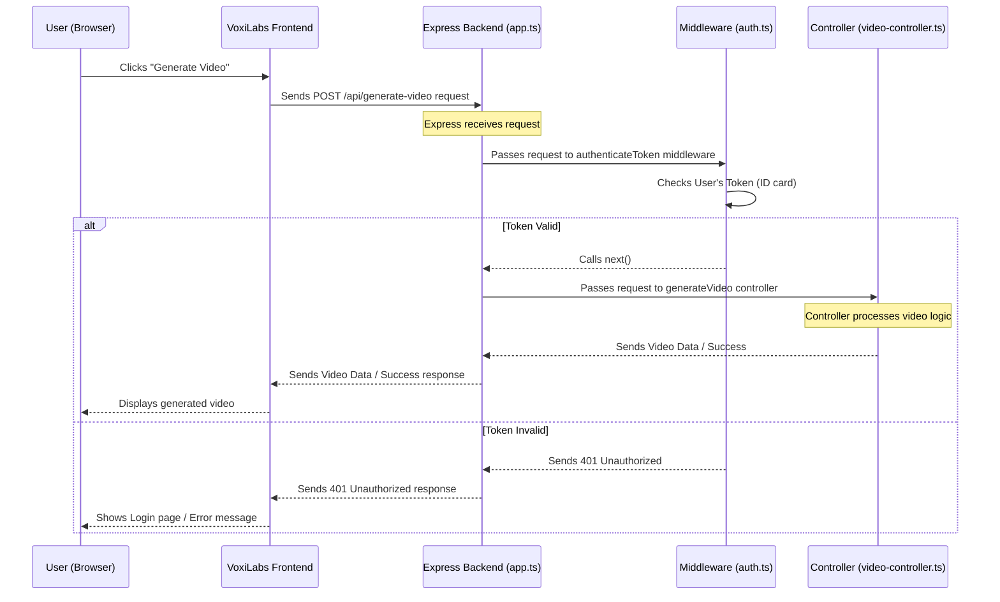

# Chapter 5: Express.js Backend API

Welcome back to the VoxiLabs tutorial! In the [previous chapter](04_video_generation_service_.md), we explored the exciting **Video Generation Service**, learning how VoxiLabs turns your text ideas into stunning AI-generated videos. We saw how the frontend sends a request for video generation and how the backend communicates with powerful AI models.

But how does the frontend actually *talk* to the backend? And how does the backend know what to do with all those incoming requests, whether it's for logging in, fetching user data, or generating a video? This is where the **Express.js Backend API** comes in.

## Why Do We Need an Express.js Backend API?

Imagine VoxiLabs as a complex machine. You've seen the beautiful user interface (our frontend, built with Shadcn UI in [Chapter 1](01_shadcn_ui_component_library_.md)), and you know there's powerful video generation magic happening (our Video Generation Service in [Chapter 4](04_video_generation_service_.md)). But how do all these parts connect and communicate?

This is the job of our **Express.js Backend API**. Think of it as the **central nervous system** or the **brain** of the VoxiLabs application. It's the part that:

*   **Listens for requests:** It's always waiting for messages from the frontend (your browser).
*   **Understands what to do:** When a message arrives (e.g., "sign me up" or "generate this video"), it figures out which specific task needs to be performed.
*   **Coordinates actions:** It directs the request to the right "specialist" (like the Authentication System or Video Generation Service).
*   **Sends back responses:** After the task is done, it sends the results (e.g., "you're logged in!" or the generated video) back to the frontend.

Without this central API, our frontend would be like a car without an engine – it looks good but can't *do* anything!

## Key Concepts of the Express.js Backend API

Our Express.js Backend API is structured to handle various types of requests efficiently. Let's break down its core ideas:

1.  **What is Express.js?**
    *   Express.js is a very popular, minimalist, and flexible web application framework for Node.js.
    *   **Analogy:** If Node.js is the foundation (like the ground you build a house on), Express.js is the **blueprint and construction crew** that helps you quickly and easily build the actual house (our server-side application) on that foundation. It provides tools to manage incoming requests and send responses.

2.  **What is an API?**
    *   API stands for **Application Programming Interface**. It's a set of rules and definitions that allow different software applications to communicate with each other.
    *   **Analogy:** Think of an API like a **menu in a restaurant**. You (the frontend) don't go into the kitchen (the backend) to cook your food. Instead, you look at the menu (the API), choose what you want (a specific request, like "Sign Up" or "Generate Video"), and the kitchen (the backend) prepares it according to its defined procedures and sends it back to you.

3.  **Routes:**
    *   In Express.js, **routes** are like specific addresses or paths (URLs) that your API listens to. Each route is associated with a specific action.
    *   **Analogy:** If the entire VoxiLabs backend is a big building, each route is a **specific door with a unique number** (like `/api/auth/login` or `/api/generate-video`). When you send a request, you're knocking on a specific door to get a particular service.

4.  **Controllers:**
    *   A **controller** is a function that contains the actual logic to handle a specific request for a route.
    *   **Analogy:** Following the "building" analogy, once you go through a specific door (route), you meet a **specialist person** (controller) inside that room. This person knows exactly how to perform the task you requested (e.g., process a login, generate a video).

5.  **Middleware:**
    *   **Middleware** functions are like security checks or steps that run *before* the main logic of a route. They can perform tasks like checking if a user is logged in, logging request details, or modifying the request before it reaches the controller.
    *   **Analogy:** Before you even get to the specific room (controller) in the building, you might have to go through a **security checkpoint** (middleware) at the entrance. This checkpoint verifies your ID, or checks your bag, before letting you proceed.

## How VoxiLabs Uses the Express.js Backend API: The "Generate Video" Flow

Let's revisit our "Generate Video" example from [Chapter 4: Video Generation Service](04_video_generation_service_.md) and see how the Express.js Backend API coordinates it all.

When you click "Generate Video" in the VoxiLabs frontend:

```typescript
// frontend/src/pages/Editor.tsx (simplified frontend fetch)
const BACKEND_URL = import.meta.env.VITE_API_URL || 'http://localhost:5000/api';

const handleGenerate = async () => {
  const script = "A cat flying a spaceship"; // Your prompt
  const token = localStorage.getItem('token'); // Your authentication token (ID card)

  try {
    const response = await fetch(`${BACKEND_URL}/generate-video`, {
      method: 'POST',
      headers: {
        'Content-Type': 'application/json',
        'Authorization': `Bearer ${token}`, // Send your ID card
      },
      body: JSON.stringify({ prompt: script }), // Your video idea
    });

    if (!response.ok) {
      throw new Error("Failed to generate video on the server.");
    }

    const videoBlob = await response.blob(); // Get the video data
    // ... display video on frontend ...
  } catch (error) {
    console.error("Error:", error);
  }
};
```
**Explanation:**
1.  Your VoxiLabs frontend sends a `POST` request to the URL `http://localhost:5000/api/generate-video`.
2.  It includes your video `prompt` (the text description) in the `body` of the request.
3.  Crucially, it includes your `Authorization` `token` in the `headers`. This token acts as your "ID card" to prove you're an authenticated VoxiLabs user.

Now, let's see how our Express.js Backend API processes this request.

## Under the Hood: How the Express.js Backend API Works

When that request hits our server, here's a simplified sequence of what happens:



Let's dive into the key files that make this happen in our VoxiLabs backend.

### 1. The "Main Setup": `backend/src/app.ts`

This is the very first file that runs when our VoxiLabs backend starts. It sets up Express.js and defines the overall structure.

```typescript
// backend/src/app.ts (simplified)
import express from 'express';
import cors from 'cors'; // For allowing frontend to talk to backend
import authRoutes from './auth/routes/auth-routes'; // Our authentication routes
import videoRoutes from './routes/video-routes'; // Our video generation routes
import { errorHandler } from './middleware/error-handler'; // Error handler (Chapter 6)

// 1. Initialize express app
const app = express();
const PORT = process.env.PORT || 5000;

// 2. Add essential "pre-checks" (middleware) that run for all requests
app.use(cors({ origin: process.env.CLIENT_URL || 'http://localhost:3000' }));
app.use(express.json({ limit: '50mb' })); // Allows parsing JSON from requests
app.use(express.urlencoded({ extended: true, limit: '50mb' })); // Allows parsing URL-encoded data

// 3. Serve static files (like generated videos)
app.use('/videos', express.static(path.join(__dirname, '../public/videos')));

// 4. Connect "traffic cops" (routers) for different parts of the API
app.use('/api/auth', authRoutes); // All /api/auth/* requests go to authRoutes
app.use('/api', videoRoutes);     // All /api/* requests go to videoRoutes (if not /api/auth)

// 5. Add a general "oops" handler (error middleware)
app.use(errorHandler);

// 6. Start the server, listening for requests
app.listen(PORT, () => {
  console.log(`Server running on port ${PORT}`);
});
```
**Explanation:**
*   **`const app = express();`**: This line creates our main Express.js application instance.
*   **`app.use(cors())`**: This is a middleware that handles **CORS (Cross-Origin Resource Sharing)**. It's like a bouncer that allows our frontend (running on `http://localhost:3000`) to send requests to our backend (running on `http://localhost:5000`). Without it, your browser would block the communication for security reasons.
*   **`app.use(express.json())`**: This middleware automatically reads incoming requests that have JSON data (like our video `prompt`) and makes it easy to access in our controllers.
*   **`app.use('/videos', express.static(...))`**: This tells Express to serve files from the `public/videos` folder whenever a request comes to `/videos`. This is how your browser can access the generated video files directly (e.g., `http://localhost:5000/videos/your-video.mp4`).
*   **`app.use('/api/auth', authRoutes)`**: This is how we "mount" our different sets of routes. Any request starting with `/api/auth` (like `/api/auth/login` or `/api/auth/register`) will be handled by the `authRoutes` file.
*   **`app.use('/api', videoRoutes)`**: Similarly, requests starting with `/api` (like `/api/generate-video`) will go to `videoRoutes`.
*   **`app.use(errorHandler)`**: This is a special type of middleware (from `errorHandler.ts`) that catches any errors that happen during request processing and sends a consistent error message back to the client. This is good for showing user-friendly errors instead of cryptic server messages. We will cover this in more detail in [Chapter 6: Route Protection (Authentication Middleware)](06_route_protection__authentication_middleware__.md) as part of general middleware concepts.
*   **`app.listen(PORT, ...)`**: This starts the web server, making it listen for incoming requests on the specified `PORT` (e.g., 5000).

### 2. The "Traffic Cop for Videos": `backend/src/routes/video-routes.ts`

This file is dedicated to defining all the API "doors" related to video operations.

```typescript
// backend/src/routes/video-routes.ts (simplified)
import { Router } from 'express';
import { generateVideo } from '../controllers/video-controller'; // Our video controller
import { authenticateToken } from '../middleware/auth'; // Our authentication middleware

const router = Router(); // Create a new Express router

// This middleware runs BEFORE any video route is handled
// It checks if the user is logged in (has a valid token)
router.use(authenticateToken); // Explained in detail in Chapter 6!

// Define the route for generating a video
// When a POST request comes to /api/generate-video, it calls generateVideo
router.post('/generate-video', generateVideo);

// Other video-related routes would be here, like:
// router.get('/videos', getUserVideos); // Get all videos for a user
// router.get('/videos/:id', getVideo); // Get a single video by ID

export default router;
```
**Explanation:**
*   **`const router = Router();`**: Express.js provides `Router` to group related routes together. This helps keep our code organized.
*   **`router.use(authenticateToken);`**: This is a powerful application of middleware. It means that *any* request that comes to a route defined in *this* `video-routes.ts` file will first pass through the `authenticateToken` function. If the user is not authenticated, this middleware will immediately send an error response and prevent the request from reaching the `generateVideo` controller. This is **route protection**, which we'll explore in [Chapter 6](06_route_protection__authentication_middleware__.md).
*   **`router.post('/generate-video', generateVideo);`**: This line tells our Express router: "When you receive a `POST` request to `/generate-video`, please call the `generateVideo` function from our controller to handle it." The `/api` part is handled by `app.use('/api', videoRoutes)` in `app.ts`.

### 3. The "Video Specialist": `backend/src/controllers/video-controller.ts`

This file contains the actual functions that perform the tasks for each video route.

```typescript
// backend/src/controllers/video-controller.ts (simplified generateVideo)
import { Request, Response } from 'express';
// import { InferenceClient } from "@huggingface/inference"; // Tool to talk to Hugging Face (Chapter 4)
// import { PrismaClient } from '@prisma/client'; // Tool to talk to database (Chapter 7)

export const generateVideo = async (req: Request, res: Response): Promise<void> => {
  try {
    const { prompt } = req.body; // Get the user's prompt from the request body
    const userId = req.user?.id; // Get user ID which was added by authentication middleware

    console.log(`Received prompt: "${prompt}" for user: ${userId}`);

    // This is where the actual video generation magic happens!
    // (As explained in Chapter 4: Video Generation Service)
    // await prisma.video.create(...)
    // const videoData = await client.textToVideo(...)
    // await fs.writeFile(...)
    // await prisma.video.update(...)

    // Send a success message or the video data back to the frontend
    res.setHeader('Content-Type', 'video/mp4'); // Tell the browser it's a video
    res.status(200).send("Video_File_Data_Goes_Here"); // Send the generated video data back
    // Or if sending status:
    // res.status(200).json({ message: 'Video generation started!' });

  } catch (error) {
    console.error('Error generating video:', error);
    res.status(500).json({ message: 'Failed to generate video' });
  }
};
```
**Explanation:**
*   **`export const generateVideo = async (req: Request, res: Response): Promise<void> => { ... }`**: This is the controller function.
    *   `req` (Request) is an object containing all information about the incoming request (like the `prompt` in `req.body` and `userId` from `req.user`).
    *   `res` (Response) is an object used to send back a response to the frontend (e.g., `res.status(200).send(...)` or `res.status(500).json(...)`).
*   Inside this function, the controller performs the specific task. For `generateVideo`, this involves taking the `prompt`, interacting with the AI model, saving the video, updating the database, and finally sending the video back to the frontend. (The detailed steps for video generation are covered in [Chapter 4](04_video_generation_service_.md)).

### 4. Middleware in Action: `backend/src/middleware/auth.ts`

While `auth.ts` is fully detailed in [Chapter 6: Route Protection (Authentication Middleware)](06_route_protection__authentication_middleware__.md), it's important to see how it acts as a **middleware** within our Express.js API structure.

```typescript
// backend/src/middleware/auth.ts (simplified)
import { Request, Response, NextFunction } from 'express';
// import jwt from 'jsonwebtoken'; // For verifying tokens

// This interface adds a 'user' property to the Express Request object
declare global {
  namespace Express {
    interface Request {
      user?: { id: string; email: string; };
    }
  }
}

export const authenticateToken = async (
  req: Request,
  res: Response,
  next: NextFunction // This function tells Express to go to the next middleware/controller
): Promise<void> => {
  const authHeader = req.headers['authorization']; // Get "Authorization: Bearer YOUR_TOKEN"
  const token = authHeader && authHeader.split(' ')[1]; // Extract the token

  if (!token) {
    res.status(401).json({ message: 'No token provided' }); return;
  }

  try {
    // const decoded = jwt.verify(token, process.env.JWT_SECRET) as JwtPayload;
    // req.user = { id: decoded.userId, email: decoded.email }; // Add user info to request

    console.log("Token successfully verified! User is authenticated."); // For demo
    req.user = { id: "user123", email: "test@example.com" }; // Mock user for demo

    next(); // Pass control to the next middleware or the route's controller!
  } catch (error) {
    res.status(401).json({ message: 'Invalid token' });
  }
};
```
**Explanation:**
*   **`next: NextFunction`**: This is the key part of any Express.js middleware. If the middleware successfully completes its task (e.g., verifies the token), it *must* call `next()` to pass control to the next middleware in the chain or to the final route controller. If it doesn't call `next()` (e.g., if the token is invalid), it should send a response (like `res.status(401).json(...)`) to stop the request processing.
*   In `authenticateToken`, it checks the `Authorization` header for the user's token. If valid, it adds the user's ID and email to the `req.user` object (so later controllers know who made the request) and calls `next()`. If invalid, it sends a `401 Unauthorized` response.

## Conclusion

In this chapter, we've introduced the **Express.js Backend API**, the "brain" or "central nervous system" of VoxiLabs. We learned how it serves as the command center, receiving requests from the frontend, routing them to the correct logic, and sending back responses. We explored key concepts like routes, controllers, and middleware, seeing how they work together to orchestrate complex operations like video generation.

Understanding Express.js is fundamental to building any modern web application. One of the most critical uses of middleware in our Express.js API is to protect sensitive routes. Next up, we'll dive deeper into exactly that: [Route Protection (Authentication Middleware)](06_route_protection__authentication_middleware__.md)!

---