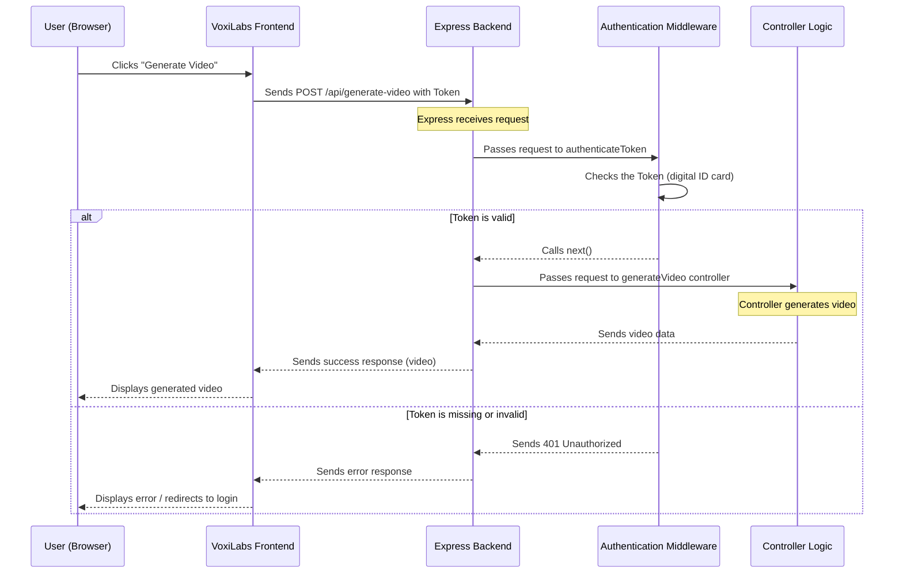

# Chapter 6: Route Protection (Authentication Middleware)

Welcome back to the VoxiLabs tutorial! In the [previous chapter](05_express_js_backend_api_.md), we learned about the **Express.js Backend API**, which acts as the central brain, listening for requests and directing them to the right parts of our application.

Now, imagine our VoxiLabs application has special areas, like your personal dashboard where you see your generated videos, or the video editor where you create new ones. We wouldn't want just anyone walking into these areas without permission, right? This is where **Route Protection (Authentication Middleware)** comes into play.

## Why Do We Need Route Protection?

Think of VoxiLabs as an exclusive club. When you first arrive, you can see the outside, maybe the sign, but you can't get into the dance floor or the VIP lounge without showing your ID.

This is exactly the problem Route Protection solves:

*   **Security:** We need to make sure sensitive information (like your private videos) and powerful features (like generating new videos) are only accessible to the correct, logged-in users.
*   **Restricted Access:** Not every part of the application is public. The "Dashboard" or "Video Editor" pages are only meaningful for someone who has an account and is logged in.

**Our goal for this chapter is to understand how VoxiLabs ensures that only authenticated users (those who have successfully logged in) can access specific pages on the frontend and specific functions on the backend.** It's like having a bouncer at the club's entrance, checking IDs to grant entry to exclusive areas.

## Key Concepts of Route Protection

Route protection in VoxiLabs involves a coordinated effort between the frontend and the backend.

1.  **Authentication:** This is the act of proving who you are. In VoxiLabs, after you log in, the backend gives you a special digital ID card called a **JWT (JSON Web Token)**, which we discussed in [Chapter 2: Authentication System](02_authentication_system_.md). This token is your proof of identity.

2.  **Middleware:** As we briefly touched upon in [Chapter 5: Express.js Backend API](05_express_js_backend_api_.md), middleware functions are like checkpoints that requests go through *before* reaching their final destination. They can inspect the request, make decisions, and then either let it proceed or block it.

3.  **Frontend Protection (`ProtectedRoute`):**
    *   This is what stops unauthorized users from even *seeing* a restricted page in their browser.
    *   If you try to go to `/dashboard` without being logged in, the frontend will automatically redirect you to the `/login` page.

4.  **Backend Protection (Authentication Middleware):**
    *   This is the server-side bouncer. Even if someone somehow tries to trick the frontend and sends a direct request to a protected API (like `/api/generate-video`), the backend's authentication middleware will intercept it.
    *   It checks for your digital ID card (your token). If it's missing or invalid, the backend immediately says "Access Denied!" and doesn't process the request.

Together, these two layers create a robust security system for VoxiLabs.

## Route Protection in VoxiLabs (Frontend)

On the frontend, VoxiLabs uses a special React component called `ProtectedRoute.tsx` to wrap pages that require a user to be logged in.

### The `ProtectedRoute` Component (`frontend/src/components/ProtectedRoute.tsx`)

This component acts as the gatekeeper for our frontend routes.

```typescript
// frontend/src/components/ProtectedRoute.tsx
import { Navigate, useLocation } from 'react-router-dom';
import authService from '@/services/auth'; // Our authentication checker

interface ProtectedRouteProps {
  children: React.ReactNode; // The page content to protect
}

const ProtectedRoute: React.FC<ProtectedRouteProps> = ({ children }) => {
  const location = useLocation();
  const isAuthenticated = authService.isAuthenticated(); // Check if user has a token

  if (!isAuthenticated) {
    // If NOT logged in, send them to the login page
    return <Navigate to="/login" state={{ from: location }} replace />;
  }

  return <>{children}</>; // If LOGGED IN, show the protected page content
};

export default ProtectedRoute;
```
**Explanation:**
*   `authService.isAuthenticated()`: This function (from [Chapter 2: Authentication System](02_authentication_system_.md)) checks if a valid authentication token (our digital ID card) exists in the browser's local storage.
*   If `isAuthenticated` is `false` (no ID card), the component uses `Navigate` to immediately send the user to the `/login` page. It also saves the `location` they were trying to reach, so after they log in, we can send them back there.
*   If `isAuthenticated` is `true` (ID card present), the component simply renders its `children`, which is the actual page content (like the Dashboard).

### How `App.tsx` Uses `ProtectedRoute` (`frontend/src/App.tsx`)

Our main application file, `App.tsx`, uses this `ProtectedRoute` to define which pages are exclusive.

```typescript
// frontend/src/App.tsx (simplified)
import { BrowserRouter, Routes, Route } from "react-router-dom";
import ProtectedRoute from "@/components/ProtectedRoute"; // Our bouncer component
import Login from "./pages/Login";
import Dashboard from "./pages/Dashboard";
import Editor from "./pages/Editor";
// ... other imports ...

const App = () => (
  <BrowserRouter>
    <Routes>
      {/* Public Routes (anyone can access) */}
      <Route path="/login" element={<Login />} />
      <Route path="/" element={<div>Welcome!</div>} />
      {/* ... other public routes like /signup, /pricing */}
      
      {/* Protected Routes (only for logged-in users) */}
      <Route path="/dashboard" element={
        <ProtectedRoute> {/* Wrap the Dashboard page */}
          <Dashboard />
        </ProtectedRoute>
      } />
      <Route path="/editor" element={
        <ProtectedRoute> {/* Wrap the Editor page */}
          <Editor />
        </ProtectedRoute>
      } />
      {/* ... other protected routes like /analytics, /settings */}
      
      {/* Catch-all route */}
      <Route path="*" element={<div>Page Not Found</div>} />
    </Routes>
  </BrowserRouter>
);

export default App;
```
**Explanation:**
*   Notice how `Dashboard` and `Editor` components are wrapped inside `<ProtectedRoute>...</ProtectedRoute>`. This tells the React Router (our navigation system) to apply the `ProtectedRoute` logic whenever someone tries to visit these paths.
*   **What happens:** If an unauthenticated user tries to go to `/dashboard`, `ProtectedRoute` intercepts, sees no token, and immediately changes the URL to `/login`. If they are authenticated, `ProtectedRoute` lets the `Dashboard` component render normally.

## Route Protection in VoxiLabs (Backend)

Frontend protection is great for user experience, but it's not enough for security. We also need our backend API to verify every request to sensitive endpoints. This is done using **authentication middleware**.

### High-Level Flow: Protected Backend API Request

Here's what happens when the frontend tries to access a protected backend API endpoint, like generating a video:



### The Authentication Middleware (`backend/src/middleware/auth.ts`)

This file contains the `authenticateToken` function, which is our backend's main "bouncer" for API requests.

```typescript
// backend/src/middleware/auth.ts
import { Request, Response, NextFunction } from 'express';
import jwt from 'jsonwebtoken'; // Tool to verify JWT tokens

// This tells TypeScript that our Request object might have a 'user' property
declare global {
  namespace Express {
    interface Request {
      user?: { id: string; email: string; };
    }
  }
}

export const authenticateToken = async (
  req: Request,
  res: Response,
  next: NextFunction // This function tells Express to proceed
): Promise<void> => {
  try {
    const authHeader = req.headers['authorization']; // Get "Authorization: Bearer YOUR_TOKEN"
    const token = authHeader && authHeader.split(' ')[1]; // Extract the token part

    if (!token) {
      res.status(401).json({ message: 'No token provided' }); // Send error if no token
      return;
    }

    if (!process.env.JWT_SECRET) {
      res.status(500).json({ message: 'JWT secret not configured' }); // Server error
      return;
    }

    // Verify the token using our secret key
    const decoded = jwt.verify(token, process.env.JWT_SECRET) as { userId: string; email: string; };
    
    // If valid, attach user info to the request object
    req.user = {
      id: decoded.userId,
      email: decoded.email
    };

    next(); // IMPORTANT: Pass control to the next middleware or the route's controller
  } catch (error) {
    console.error('Authentication error:', error);
    res.status(401).json({ // Send error if token is invalid or expired
      message: 'Invalid token',
      error: error instanceof Error ? error.message : 'Unknown error'
    });
  }
};
```
**Explanation:**
*   **`req.headers['authorization']`**: When the frontend makes a request to a protected backend route, it includes the JWT in a special header called `Authorization`, usually in the format `Bearer YOUR_TOKEN_HERE`. This line retrieves that header.
*   **`jwt.verify(token, process.env.JWT_SECRET)`**: This is the core of the verification. It uses the `jsonwebtoken` library to check two things:
    1.  Is the token *really* signed by our backend's secret key? (Prevents faking).
    2.  Has the token expired? (Tokens usually have an expiry date, from [Chapter 2: Authentication System](02_authentication_system_.md)).
*   **`req.user = {...}`**: If the token is valid, we extract the user's `id` and `email` (which were embedded in the token when it was created during login) and attach them to the `req` (request) object. This means any subsequent function (like our `generateVideo` controller) can easily know *which user* is making the request.
*   **`next()`**: If everything is successful, `next()` is called. This tells Express.js to pass the request to the *next* function in line, which is usually the actual controller function (e.g., `generateVideo`) that will process the request.
*   **Error Handling:** If there's no token, or if the token is invalid/expired, `res.status(401).json(...)` is sent. A `401` status code means "Unauthorized," signaling to the frontend that the user is not allowed to access this resource.

### Applying Middleware to Routes

Now let's see how our backend routes use this `authenticateToken` middleware.

#### 1. Applying to all routes in a router (`backend/src/routes/video-routes.ts`)

This is a common way to protect multiple routes at once.

```typescript
// backend/src/routes/video-routes.ts
import { Router } from 'express';
import { generateVideo, getUserVideos } from '../controllers/video-controller';
import { authenticateToken } from '../middleware/auth'; // Our authentication middleware

const router = Router();

// Apply authenticateToken middleware to ALL routes defined below in this router
router.use(authenticateToken);

router.post('/generate-video', generateVideo); // Now protected!
router.get('/videos', getUserVideos);         // Now protected!
// ... other video routes are also protected
```
**Explanation:**
*   `router.use(authenticateToken);`: By putting this line at the top of the `video-routes.ts` file, we're telling Express: "Any request that comes to an endpoint defined in *this* router (like `/api/generate-video` or `/api/videos`) *must first pass through* the `authenticateToken` middleware."
*   This makes it very efficient to protect an entire group of related API endpoints.

#### 2. Applying to individual routes (`backend/src/routes/dashboard-routes.ts`)

Sometimes, you might only want to protect specific routes within a file, or you might want to chain multiple middleware functions.

```typescript
// backend/src/routes/dashboard-routes.ts
import { Router } from 'express';
import { getDashboardStats, getRecentProjects } from '../controllers/dashboard-controller';
import { authenticateToken } from '../middleware/auth'; // Our authentication middleware

const router = Router();

// Apply authenticateToken to this specific route
router.get('/stats', authenticateToken, getDashboardStats);

// Apply authenticateToken to this specific route as well
router.get('/projects', authenticateToken, getRecentProjects);

export default router;
```
**Explanation:**
*   Here, `authenticateToken` is placed directly as the *second argument* to `router.get`. This means that when a request comes to `/stats`, the `authenticateToken` middleware will run *before* the `getDashboardStats` controller.
*   This approach gives you fine-grained control over which routes are protected and allows you to add different middleware to different routes.

## Conclusion

In this chapter, we've explored the crucial concept of **Route Protection (Authentication Middleware)** in VoxiLabs. We learned that it's like a dual-layer security system, with `ProtectedRoute` on the frontend preventing unauthorized access to pages, and `authenticateToken` middleware on the backend verifying every API request. Together, these ensure that only authenticated users can access the sensitive features and data within VoxiLabs, making our application secure and reliable.

Now that we understand how our application's access is managed, the next logical step is to dive deeper into how VoxiLabs stores and retrieves all its important information, from user accounts to video details. Next up, we'll learn about the [Prisma ORM & Database Layer](07_prisma_orm___database_layer_.md)!

---