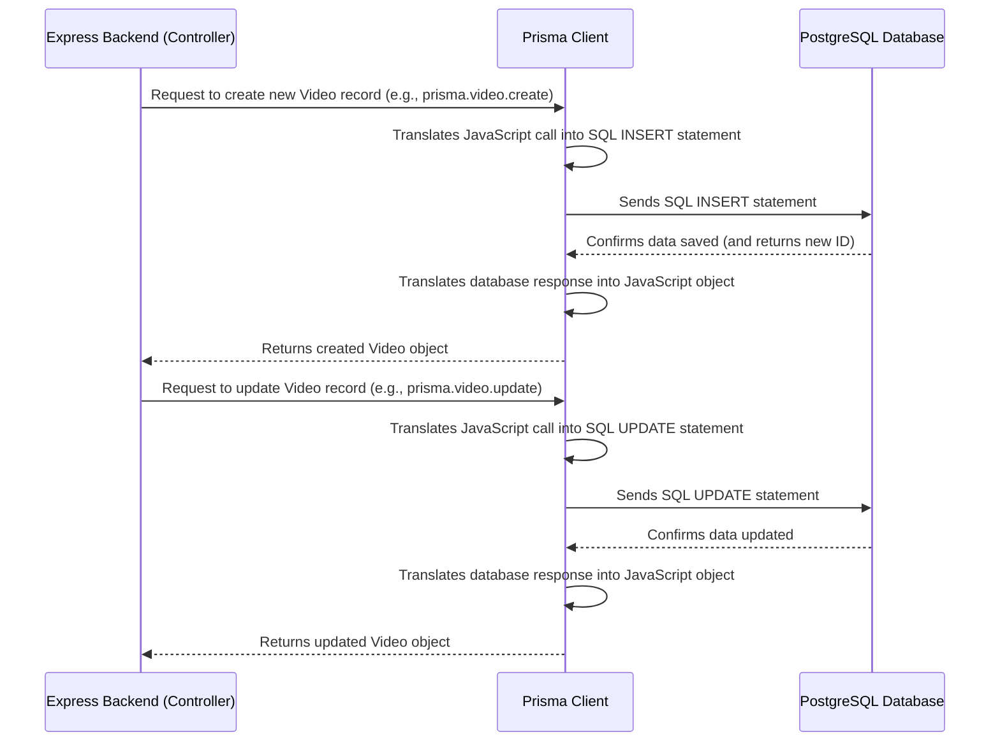

# Chapter 7: Prisma ORM & Database Layer

Welcome back to the VoxiLabs tutorial! In the [previous chapter](06_route_protection__authentication_middleware__.md), we learned how VoxiLabs secures its application using **Route Protection** on both the frontend and backend, acting like a strict bouncer at an exclusive club, ensuring only authorized users can access special features.

Now that we know *who* can access our application, the next crucial step is to understand *how* VoxiLabs remembers everything important. Where do we store user accounts, their generated videos, and all the other crucial information that makes VoxiLabs work? This is where **Prisma ORM & Database Layer** comes into play.

## Why Do We Need Prisma ORM?

Imagine you're trying to talk to someone who speaks a completely different language, like an ancient dialect of SQL (Structured Query Language), which is what databases understand. You'd need a translator, right?

Without a translator, every time you want to save a user's email, update a video's status, or find all videos generated by a specific user, you'd have to write complex, precise sentences in that ancient SQL dialect. This is:

*   **Hard to learn:** SQL has its own syntax and rules.
*   **Time-consuming:** You have to write specific SQL queries for every operation.
*   **Prone to errors:** A small typo can break everything.
*   **Less efficient for developers:** It mixes two different programming styles (JavaScript/TypeScript and SQL).

This is the problem **Prisma ORM** solves! ORM stands for **Object-Relational Mapper**. It's like having a **universal translator** for your database. Instead of writing complex SQL queries directly, developers use familiar JavaScript/TypeScript code to manage data. Prisma translates your intuitive code into the SQL the database understands, and then translates the database's response back into JavaScript objects.

For VoxiLabs, Prisma allows our backend to "talk" to our PostgreSQL database seamlessly, abstracting away the complexities of raw SQL. This means our developers can focus on building awesome features like video generation, rather than wrestling with database commands.

**Our central use case for this chapter:** We'll see how Prisma makes it easy to save new user information and update the status of a generated video in our database, just like we saw in [Chapter 4: Video Generation Service](04_video_generation_service_.md).

## Key Concepts of Prisma ORM

Let's break down the main ideas behind Prisma:

1.  **Object-Relational Mapper (ORM):**
    *   **Object:** In programming, an "object" is a structured piece of data (like a `User` object with properties `firstName`, `email`, `password`).
    *   **Relational Database:** Our PostgreSQL database stores data in "tables" with rows and columns, like a spreadsheet. These tables are "relational" because they can be linked together (e.g., a `Video` table might be linked to a `User` table to show who created the video).
    *   **Mapper:** An ORM "maps" (or translates) between these two worlds. It lets you work with database tables as if they were just regular JavaScript objects!

2.  **Prisma Schema:**
    *   This is a special file (`prisma/schema.prisma`) where you define the **structure of your database** in a clear, human-readable way. It's like drawing a blueprint for your database.
    *   You define **models**, which represent tables in your database (e.g., `User` model means a `User` table).
    *   You define **fields** within each model, which represent the columns in your table (e.g., `email`, `password`, `createdAt`).
    *   Prisma then uses this schema to automatically create or update your database tables.

3.  **Prisma Client:**
    *   This is the **actual translator** that Prisma generates for you based on your schema.
    *   It's a collection of JavaScript/TypeScript functions that allows your application to interact with your database using familiar code, without writing any SQL yourself.
    *   For example, instead of writing `INSERT INTO users (email, password) VALUES ('...', '...')` in SQL, you would use `prisma.user.create({ data: { email: '...', password: '...' } })` in your JavaScript/TypeScript code. Much cleaner!

## How VoxiLabs Uses Prisma: Saving and Updating Video Records

Let's revisit the **Video Generation Service** from [Chapter 4](04_video_generation_service_.md). When a user prompts VoxiLabs to create a video, our backend needs to:
1.  Create a new record in the database to track that video, setting its status to "processing."
2.  Later, update that same record to "completed" (or "failed") and save the URL of the generated video.

Prisma makes these database interactions simple and straightforward.

### Frontend Interaction (Indirect)

The frontend (e.g., `frontend/src/pages/Editor.tsx`) doesn't directly use Prisma. It just sends a request to the backend:

```typescript
// frontend/src/pages/Editor.tsx (Simplified request to backend)
const handleGenerate = async () => {
  const script = "A cat flying a spaceship";
  // ... (get user token, set loading state) ...

  const response = await fetch(`${BACKEND_URL}/generate-video`, {
    method: 'POST',
    headers: { 'Content-Type': 'application/json', 'Authorization': `Bearer ${token}` },
    body: JSON.stringify({ prompt: script }), // This goes to the backend!
  });

  // ... (handle response, display video) ...
};
```
When this request hits our backend, that's where Prisma comes in!

### Backend Interaction (`backend/src/controllers/video-controller.ts`)

The `generateVideo` function in our video controller is where the magic happens for database interaction:

```typescript
// backend/src/controllers/video-controller.ts (Simplified Prisma calls)
import { Request, Response } from 'express';
// ... other imports ...
import { prisma } from '../db/prisma'; // Our Prisma Client instance

export const generateVideo = async (req: Request, res: Response): Promise<void> => {
  try {
    const { prompt, title } = req.body;
    const userId = req.user?.id;

    // 1. Create a new video record in the database (status: 'processing')
    const video = await prisma.video.create({
      data: {
        title: title || 'Untitled Video',
        prompt,
        status: 'processing',
        userId // Link the video to the user who created it
      }
    });
    console.log('New video record created with ID:', video.id);

    // ... (Call Hugging Face AI to generate actual video, save file) ...
    // (This part is explained in Chapter 4)

    const generatedVideoUrl = '/videos/unique-filename.mp4'; // Example URL

    // 2. Update the video record with the URL and new status ('completed')
    await prisma.video.update({
      where: { id: video.id }, // Find the video by its ID
      data: {
        url: generatedVideoUrl,
        status: 'completed'
      }
    });
    console.log('Video record updated:', video.id);

    // ... (Send video data back to frontend) ...
  } catch (error) {
    // ... (Error handling, update status to 'failed' if needed) ...
  }
};
```
**Explanation:**
1.  **`prisma.video.create({...})`**: This line tells Prisma to insert a new row into the `Video` table in our database.
    *   `data`: This is where we provide the values for the columns: `title`, `prompt`, `status` (initially 'processing'), and `userId` (to link it to the user).
    *   **Output:** Prisma performs the SQL `INSERT` command behind the scenes and returns a JavaScript object representing the newly created video record, including its `id`.
2.  **`prisma.video.update({...})`**: Once the video is actually generated and saved to a file, we use this line to update the existing video record.
    *   `where: { id: video.id }`: This tells Prisma *which* record to update (the one matching the `id` of the video we just created).
    *   `data: { url: ..., status: ... }`: This provides the new values for the `url` and `status` columns.
    *   **Output:** Prisma performs the SQL `UPDATE` command and returns the updated JavaScript object.

As you can see, using Prisma Client methods like `.create()` and `.update()` is much more intuitive than writing raw SQL.

## Under the Hood: How Prisma ORM & Database Layer Works

Let's dive deeper into how Prisma operates behind the scenes to manage your data.

### High-Level Flow: Database Interaction

Here’s a simplified sequence of how our Express backend (using Prisma) interacts with the PostgreSQL database:



### The Backend Components in Detail

The core of VoxiLabs' database layer relies on these key files:

#### 1. The "Database Blueprint": `backend/prisma/schema.prisma`

This file is the single source of truth for your database structure. Prisma reads this file to understand your data models and generate the Prisma Client.

```prisma
// backend/prisma/schema.prisma

generator client {
  provider = "prisma-client-js"
}

datasource db {
  provider = "postgresql" // We are using PostgreSQL
  url      = env("DATABASE_URL") // Connection string from environment variables
}

model User {
  id                String    @id @default(cuid()) // Unique ID, generated automatically
  firstName         String
  lastName          String
  email             String    @unique // Email must be unique
  phone             String?   // Optional phone number
  password          String
  createdAt         DateTime  @default(now()) // Timestamp when user was created
  updatedAt         DateTime  @updatedAt // Automatically updates on record change
  emailVerified     DateTime? // Optional timestamp if email is verified
  image             String?
  twoFactorSecret   String?   @unique
  
  // Relations to other tables
  sessions          Session[]
  accounts          Account[]
  videos            Video[]   // A user can have many videos
}

model Video {
  id          String   @id @default(cuid())
  title       String
  prompt      String   @db.Text // Store longer text
  status      String   // e.g., 'completed', 'processing', 'failed'
  url         String?  // Optional URL to the video file
  duration    Float?   // Optional duration in seconds
  createdAt   DateTime @default(now())
  updatedAt   DateTime @updatedAt
  userId      String   // Foreign key linking to User
  user        User     @relation(fields: [userId], references: [id], onDelete: Cascade)
  
  @@index([userId]) // For faster queries when fetching user's videos
}
// ... (other models like Session, VerificationToken, Account)
```
**Explanation:**
*   **`model User { ... }`**: Defines the `User` table.
    *   `id String @id @default(cuid())`: Every user gets a unique ID generated by `cuid()`.
    *   `email String @unique`: Ensures no two users can have the same email.
    *   `Video[]`: This `Video[]` field on the `User` model, and the `User` field on the `Video` model, tell Prisma that there's a **one-to-many relationship**: one `User` can create many `Video`s.
*   **`model Video { ... }`**: Defines the `Video` table.
    *   `prompt String @db.Text`: `@db.Text` tells Prisma to use a database type that can store long strings, perfect for our video prompts.
    *   `status String`: We use this to track the generation process.
    *   `userId String` and `user User @relation(...)`: These lines define the connection back to the `User` model, specifying that each `Video` belongs to one `User`.
    *   `@@index([userId])`: This is a performance optimization. It creates an index on the `userId` column, making it much faster to search for all videos created by a particular user.

When you run `prisma migrate` or `prisma generate`, Prisma reads this `schema.prisma` file to:
1.  **Migrate your database:** Create or modify tables in your PostgreSQL database to match this schema.
2.  **Generate Prisma Client:** Create the actual `prisma` object (the translator functions) that you use in your Node.js code.

#### 2. The "Prisma Client Instance": `backend/src/db/prisma.ts`

This small but critical file initializes the Prisma Client, making it available throughout our backend application.

```typescript
// backend/src/db/prisma.ts
import { PrismaClient } from "@prisma/client";

declare global {
    var prisma: PrismaClient | undefined; // For TypeScript type safety
}

// Initialize PrismaClient. This is a singleton to prevent multiple instances
export const prisma = globalThis.prisma || new PrismaClient();

// In development, store the client on the global object to prevent hot-reloading
// from creating new connections on every code change, which can exhaust database connections.
if (process.env.NODE_ENV !== 'production' ) globalThis.prisma = prisma;
```
**Explanation:**
*   **`new PrismaClient()`**: This line creates an instance of the Prisma Client. This is the object that allows us to interact with our database using the methods generated from our schema (like `prisma.user.create()` or `prisma.video.findMany()`).
*   **`globalThis.prisma`**: This is a common trick in Node.js development environments (like when you use live-reloading) to ensure that only *one* instance of `PrismaClient` is created and reused. Creating too many database connections can cause problems. In production, this optimization isn't needed.

#### 3. The "Record Keeper": `backend/src/auth/db/user.ts`

This file encapsulates all the database operations related to the `User` model, using our `prisma` client. This separation helps keep the code organized and reusable.

```typescript
// backend/src/auth/db/user.ts (simplified)
import { PrismaClient, User, Prisma } from '@prisma/client';

const prisma = new PrismaClient(); // Import or create the client

export const findUserByEmail = async (email: string): Promise<User | null> => {
  return prisma.user.findUnique({
    where: { email }, // Find a user where their email matches
  });
};

export const createUser = async (userData: any): Promise<User> => {
  return prisma.user.create({
    data: userData, // Create a new user with the provided data
  });
};

export const updateUser = async (email: string, data: Partial<Prisma.UserUpdateInput>): Promise<User> => {
  return prisma.user.update({
    where: { email }, // Update user where email matches
    data, // Update with new data
  });
};

export const createSession = async (data: any): Promise<void> => {
  await prisma.session.create({ data }); // Create a new session record
};

export const deleteSession = async (sessionToken: string): Promise<void> => {
  await prisma.session.delete({ where: { sessionToken } }); // Delete a session
};
// ... other functions for VerificationToken interactions
```
**Explanation:**
*   Each function here (e.g., `findUserByEmail`, `createUser`) directly uses the `prisma` client methods to perform specific database actions on the `User`, `Session`, or `VerificationToken` models.
*   **`findUnique({ where: { email } })`**: This is how Prisma allows you to find a single record based on a unique field.
*   **`create({ data: userData })`**: This is the method for inserting a new record.
*   **`update({ where: { email }, data })`**: This is for modifying an existing record.

These functions are then called by the `auth-controller.ts` (as seen in [Chapter 2: Authentication System](02_authentication_system_.md)) whenever user authentication actions require database interaction.

## Conclusion

In this chapter, we've explored the **Prisma ORM & Database Layer**, a fundamental component of VoxiLabs that simplifies all interactions with our PostgreSQL database. We learned that Prisma acts as a powerful translator, allowing us to manage database records using familiar JavaScript/TypeScript code instead of complex SQL queries. We looked at the Prisma Schema as the database's blueprint and the Prisma Client as the auto-generated tool that performs the actual data operations. Finally, we saw how VoxiLabs uses Prisma to easily create and update video records, showcasing its elegance and efficiency.

With Prisma, our VoxiLabs backend can store, retrieve, and manage all its important data seamlessly, powering features from user accounts to video generation. This concludes our journey through the core components of the VoxiLabs project. We've built from the ground up, starting with beautiful UI components, moving through secure authentication, content generation, a robust backend API, and finally, a solid database layer.

---