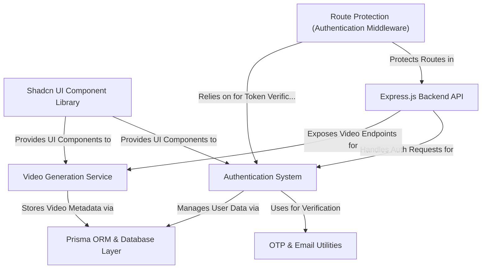

# Tutorial: VoxiLabs

VoxiLabs is an innovative platform that **transforms text into AI-generated videos**. It features a robust *Authentication System* for user management and secure access, allowing users to effortlessly **generate, manage, and preview their creative video projects**. The application is built with a structured *Express.js Backend API* and a sleek *Shadcn UI Component Library* for a seamless user experience.

## Visual Overview

## Chapters

1. [Shadcn UI Component Library
](01_shadcn_ui_component_library_.md)
2. [Authentication System
](02_authentication_system_.md)
3. [OTP & Email Utilities
](03_otp___email_utilities_.md)
4. [Video Generation Service
](04_video_generation_service_.md)
5. [Express.js Backend API
](05_express_js_backend_api_.md)
6. [Route Protection (Authentication Middleware)
](06_route_protection__authentication_middleware__.md)
7. [Prisma ORM & Database Layer
](07_prisma_orm___database_layer_.md)

---

Generated by [AI Codebase Knowledge Builder](https://github.com/The-Pocket/Tutorial-Codebase-Knowledge).