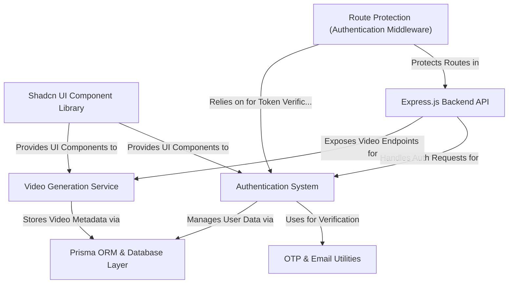

# VOXILABS - AI Text to Video Platform

VOXILABS is a cutting-edge AI-powered platform that transforms text into professional-quality videos. Built with modern technologies and best practices, it offers a seamless experience for content creators, educators, and marketers.

## 🌟 Features

### Video Generation
- Text-to-Video conversion using advanced AI
- Real-time video generation preview
- Support for multiple video formats (MP4, GIF, WebM)
- 4K resolution export capability
- Custom video duration settings

### Voice and Audio
- 100+ realistic AI voices in 50+ languages (powered by ElevenLabs)
- Voice cloning capabilities
- Custom voice creation from audio samples
- Perfect lip-sync with generated videos

### User Management
- Secure authentication system
  - Email/Password login
  - Google OAuth integration
  - JWT-based authentication
  - Email verification
  - Two-factor authentication
- User profile management
- Role-based access control

### Project Management
- Project organization and categorization
- Search and filter capabilities
- Sort by date, title, or duration
- Project status tracking (completed, processing, draft)
- File management system

### Analytics and Insights
- Detailed usage statistics
- Performance metrics
- Video view tracking
- Storage usage monitoring
- Monthly usage analytics

### Collaboration Features
- Team workspace
- Project sharing
- Real-time collaboration
- Feedback system
- Role-based permissions

### Additional Features
- Responsive design (mobile-friendly)
- Dark/Light theme support
- Real-time notifications
- Export capabilities
- Billing and subscription management

## 🛠 Technology Stack

### Frontend
- **Framework**: React 18 with TypeScript
- **Build Tool**: Vite
- **Routing**: React Router DOM
- **State Management**: React Query (TanStack Query)
- **UI Components**: 
  - Radix UI primitives
  - Shadcn UI components
  - Tailwind CSS for styling
  - Lucide React for icons
- **Form Handling**: 
  - React Hook Form
  - Zod for validation
- **HTTP Client**: Axios
- **Additional Libraries**:
  - date-fns for date manipulation
  - Sonner for toast notifications
  - Recharts for analytics visualization
  - Embla Carousel for carousels
  - React Day Picker for date selection

### Backend
- **Runtime**: Node.js with TypeScript
- **Framework**: Express.js
- **Database**: 
  - PostgreSQL
  - Prisma ORM
  - Redis for caching
- **Authentication**: 
  - JWT
  - Google Auth Library
  - Bcrypt for password hashing
  - Speakeasy for 2FA
- **Email Services**:
  - Nodemailer
  - Resend for transactional emails
- **AI Integration**:
  - Google Generative AI
  - Hugging Face Inference
- **Security**:
  - Helmet for security headers
  - CORS protection
  - Express Validator
  - Cookie Parser
- **File Handling**: Multer
- **Monitoring**: Morgan for logging

### DevOps & Tools
- **Version Control**: Git
- **Type Checking**: TypeScript
- **Linting**: ESLint
- **Development**: 
  - Nodemon for hot reloading
  - ts-node for TypeScript execution
- **Testing**: Supertest for API testing

## 🚀 Getting Started

### Prerequisites
- Node.js (v18 or higher)
- PostgreSQL
- Redis
- API keys for:
  - Google OAuth
  - ElevenLabs
  - Other AI services

### Installation

1. Clone the repository:
```bash
git clone https://github.com/yourusername/voxilabs.git
cd voxilabs
```

2. Install frontend dependencies:
```bash
cd frontend
npm install
```

3. Install backend dependencies:
```bash
cd backend
npm install
```

4. Set up environment variables:
```bash
# Backend .env
cp .env.example .env
# Fill in your environment variables

# Frontend .env
cp .env.example .env
# Fill in your environment variables
```

5. Set up the database:
```bash
cd backend
npx prisma migrate deploy
npx prisma generate
```

6. Start the development servers:
```bash
# Backend
npm run dev

# Frontend (in a new terminal)
cd frontend
npm run dev
```

## 📝 License

This project is licensed under the MIT License - see the [LICENSE](LICENSE) file for details.

## 🤝 Contributing

Contributions are welcome! Please feel free to submit a Pull Request.

## 📧 Contact

For any questions or concerns, please contact us at support@voxilabs.com 


# Tutorial: VoxiLabs

VoxiLabs is an innovative platform that **transforms text into AI-generated videos**. It features a robust *Authentication System* for user management and secure access, allowing users to effortlessly **generate, manage, and preview their creative video projects**. The application is built with a structured *Express.js Backend API* and a sleek *Shadcn UI Component Library* for a seamless user experience.


## Visual Overview



## Chapters

1. [Shadcn UI Component Library
](01_shadcn_ui_component_library_.md)
2. [Authentication System
](02_authentication_system_.md)
3. [OTP & Email Utilities
](03_otp___email_utilities_.md)
4. [Video Generation Service
](04_video_generation_service_.md)
5. [Express.js Backend API
](05_express_js_backend_api_.md)
6. [Route Protection (Authentication Middleware)
](06_route_protection__authentication_middleware__.md)
7. [Prisma ORM & Database Layer
](07_prisma_orm___database_layer_.md)

---

<sub><sup>Generated by [AI Codebase Knowledge Builder](https://github.com/The-Pocket/Tutorial-Codebase-Knowledge).</sup></sub>